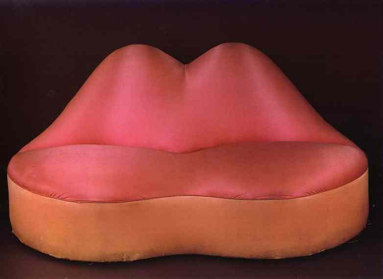

## 基本信息

- 作者：[[达利 Salvador Dalí]]（与建筑师 / 家具设计师合作完成实体版）
- 创作年代：1936（设计与原型；1937–38 多个实物版本）
- 材质：木框 + 红色羊毛绒面（实物）/ 水彩+拼贴（草图）(*not from wiki*)
- 尺寸：年代不详
- 现存地：(*not from wiki*) 多套——伦敦 V&A、布莱顿博物馆、菲格拉斯达利剧院博物馆均藏

## 画面与技法

094 中作为达利**被开除后炒作大师期蹭流量**的样本登场：

> "好莱坞女星梅·维斯特大火，他就把她的嘴唇设计成沙发，说'想想看，我的屁股坐在维斯特的嘴上'。"

(*not from wiki*) 这件作品是达利同期"形象拼贴室内装置"序列的一部分——同一思路还衍生出整个房间装置《梅·维斯特之脸（可作为超现实主义公寓）》：金黄色头发挂帘、画框做眼睛、壁炉是鼻子、红嘴唇沙发是嘴。

## 历史背景 (*not from wiki*)

委托人是英国诗人 / 收藏家 Edward James——达利后期最重要的赞助人之一。本物件是 20 世纪超现实主义**家具/装置**最具标志性的产物，预示了波普艺术的诸多手法。

## 图片清单

| 编号 | 出自 | 描述 |
|---|---|---|
| 01 | [[094｜达利：为什么他画的是"伪装的梦"？]] | 红色绒面嘴唇沙发实物 |

## 出现在

- [[094｜达利：为什么他画的是"伪装的梦"？]]
