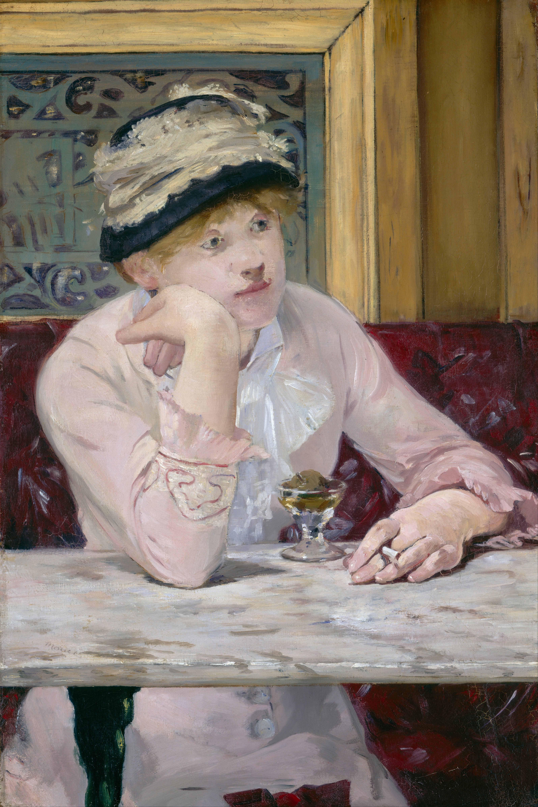

## 基本信息

- 作者：[[马奈 Édouard Manet]]
- 创作年代：1877
- 材质：油彩，画布 (*not from wiki*)
- 尺寸：73.6 × 50.2 cm (*not from wiki*)
- 现存地：华盛顿国家美术馆 (*not from wiki*)

## 画面与技法

[[马奈 Édouard Manet]] 笔下的现代咖啡馆女子像，独坐桌前、一杯白兰地浸着李子。神情怔忡，被顾衡用来举证马奈"空虚和焦虑的时代精神"——即 [[现代性 Modernité]] 中"上帝死了之后的价值真空"的视觉化。

## 历史背景 (*not from wiki*)

模特据传是女演员 Ellen Andrée。画面场景设在巴黎新拉雪兹咖啡馆（Nouvelle Athènes），1870 年代后期已成印象派与文学家聚集地。马奈这一系列"独坐女子"画作（同期还有《[[苦艾酒 The Absinthe Drinker]]》、《[[拾荒者 The Ragpicker]]》、《[[在咖啡馆 At the Cafe]]》）共同构成了他对**现代社会异化**的一组观察。

## 图片清单

| 编号 | 出自 | 描述 |
|---|---|---|
| 01 | [[038｜马奈1：为什么他是西方现代绘画的鼻祖？]] | 全图 |

## 出现在

- [[038｜马奈1：为什么他是西方现代绘画的鼻祖？]]
