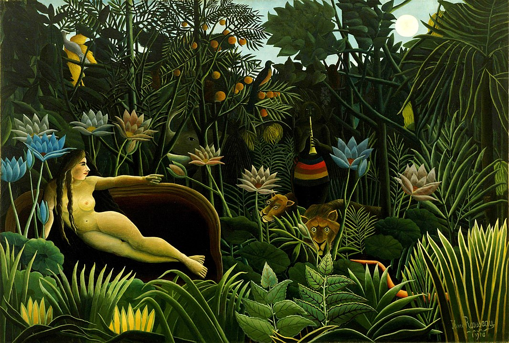

## 基本信息

- 作者：[[亨利·卢梭 Henri Rousseau]]
- 创作年代：1910
- 材质：布面油画 (*not from wiki*)
- 尺寸：204.5 × 298.5 cm (*not from wiki*)
- 现存地：纽约现代艺术博物馆 (MoMA) (*not from wiki*)

## 画面与技法

裸女斜倚红色长沙发上，沙发被搬到了丛林之中；月光下，迷蛇笛者、狮子、大象、鹦鹉、莲花……
顾衡 079 重点："每片叶子都是正面朝向观众的，看上去和咱们这边不入流的年画一模一样"——延续了 [[耍蛇者 The Snake Charmer]] 的**正面化、装饰性、程式化**手法。

> ⚠️ 与 [[梦 (毕加索) Dream (Picasso)]] 不是同一作品；前者是卢梭 1910 年丛林梦境，后者是毕加索 1932 年情人立体主义画像。文件名以 `(卢梭)` 与 `(毕加索)` 区分。

## 历史背景

卢梭逝世前最后一年的作品，也是他丛林系列的集大成者。卢梭称画中裸女是他年轻时的波兰情人 Yadwigha（*not from wiki*）。该作如今为 MoMA 藏品。

## 图片清单

| 编号 | 出自 | 描述 |
|---|---|---|
| 01 | [[079｜亨利·卢梭：毕加索对他的吹捧是真心的吗？]] | 全图：丛林中的红沙发裸女、笛者、动物 |

## 出现在

- [[079｜亨利·卢梭：毕加索对他的吹捧是真心的吗？]]
