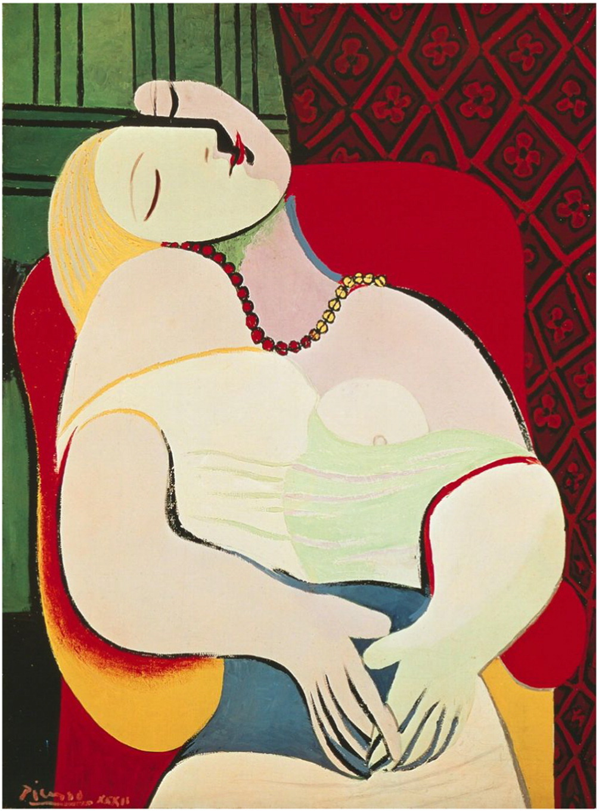

## 基本信息

- 作者：[[毕加索 Pablo Picasso]]
- 创作年代：1932
- 材质：(*not from wiki*) 布面油画
- 尺寸：(*not from wiki*) 130 × 97 cm
- 现存地：(*not from wiki*) 私人收藏（2013 年由 Steven A. Cohen 以 1.55 亿美元购入）

## 画面与技法

模特为毕加索情人 [[玛丽·泰莱斯 Marie-Thérèse Walter]]。画面是**綜合立体主义晚期的情人肖像范式**——色彩鲜艳（红绿对比）、人体被极度简化为曲线几何、双脸合体（一面正面、一面侧面）、垂头闭眼如在梦中。

顾衡 067 列入"为情人画肖像、风格高度雷同"的样本之一，说明毕加索成名后转入**艺术语言的大量重复**。

## 历史背景

(*not from wiki*) 1932 年 1 月 24 日下午一气完成。玛丽-泰莱斯·瓦尔特 (Marie-Thérèse Walter, 1909-1977) 是毕加索 1927 年（她 17 岁）勾搭的情人，1935 年生女 Maya；她是毕加索"金色情人"，与毕加索的"黑色情人" [[朵拉·玛尔 Dora Maar]] 长期争宠。

## 图片清单

| 编号 | 出自 | 描述 |
|---|---|---|
| 01 | [[067｜毕加索4：什么是综合立体主义？]] | 整体图（模特：玛丽·泰莱斯） |

## 出现在

- [[067｜毕加索4：什么是综合立体主义？]]
