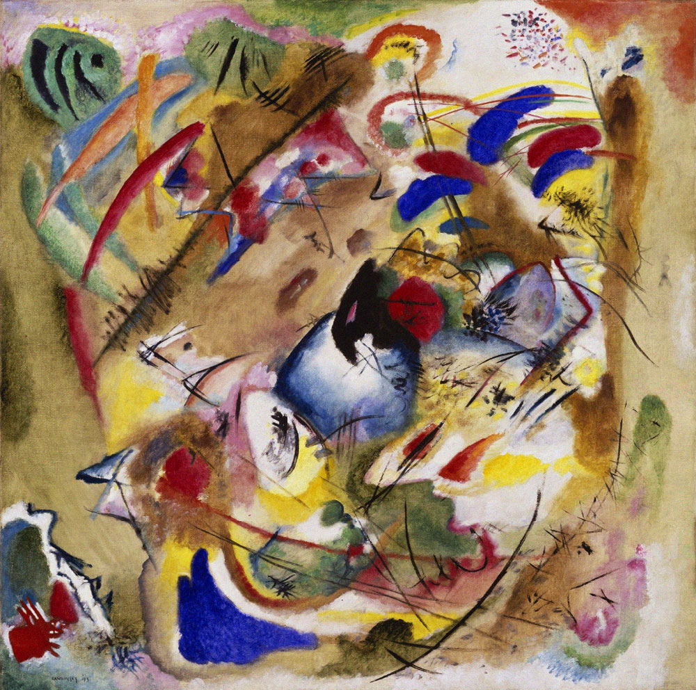

## 基本信息

- 作者：[[康定斯基 Wassily Kandinsky]]
- 创作年代：1913
- 材质：布面油画 (*not from wiki*)
- 尺寸：(*not from wiki*)
- 现存地：(*not from wiki*)

## 画面与技法

顾衡 082 与《[[即兴31号 Improvisation 31 (Sea Battle)]]》并列，作为康定斯基 1913 年**已明显抽象**的样本，但他事后给出具象解释，所以严格意义上**仍不算纯抽象画**。

## 图片清单

| 编号 | 出自 | 描述 |
|---|---|---|
| 01 | [[082｜康定斯基2：他为什么走向抽象？]] | 1913 年渐进抽象的对照样本之二 |

## 出现在

- [[082｜康定斯基2：他为什么走向抽象？]]
