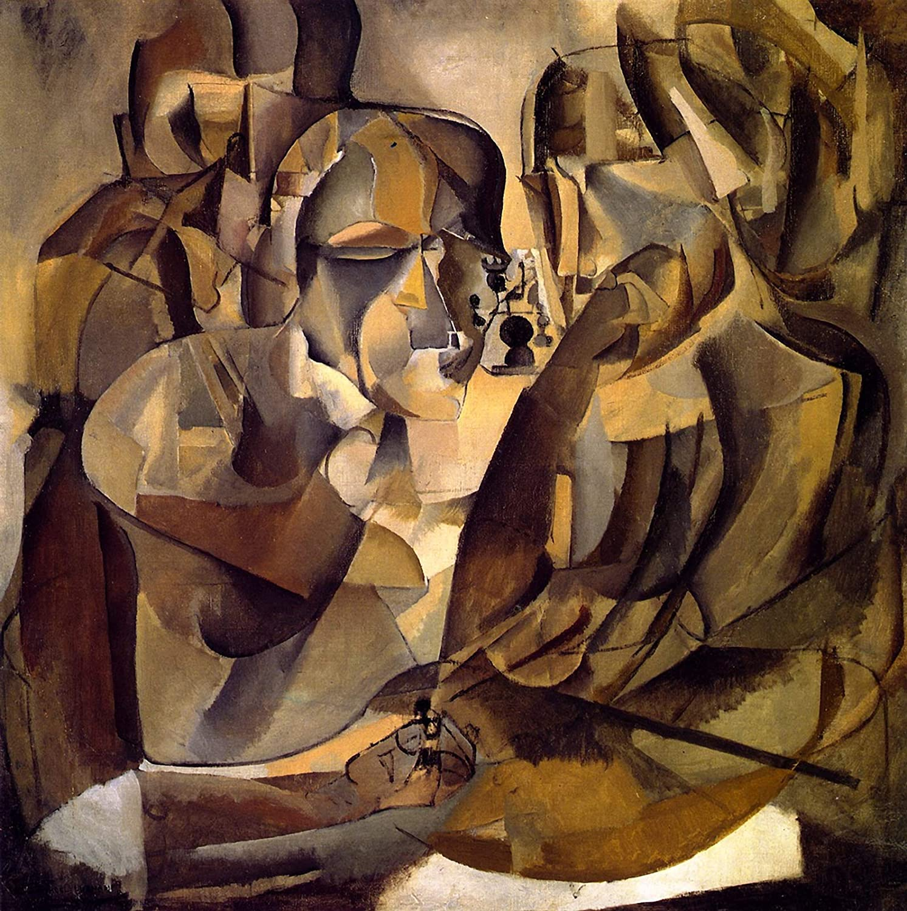

## 基本信息

- 作者：[[杜尚 Marcel Duchamp]]
- 创作年代：1911
- 材质：油画 (*not from wiki*)
- 尺寸：约 108 × 101 cm (*not from wiki*)
- 现存地：费城美术馆 Philadelphia Museum of Art (*not from wiki*)

## 画面与技法

本讲（088）作为杜尚 1911 年[[分析立体主义 Analytical Cubism]]期代表出场——与《[[小夜曲 (杜尚) Sonata]]》《[[苏珊娜肖像 (杜尚) Portrait of Suzanne Duchamp]]》并列，"都是妥妥的分析立体主义风"。

棋手是两位哥哥 [[杰克·维庸 Jacques Villon]] 与 [[西蒙·维庸 Raymond Duchamp-Villon]] (*not from wiki*)。题材延续 1910 年《[[下棋 (杜尚 1910) Chess Game]]》——但形式语言已彻底从塞尚期切换到分析立体主义。

## 历史背景

(*not from wiki*) 杜尚在 [[皮托集团 Puteaux Group]] 内的"入会作品"之一；预告他日后对国际象棋的彻底投身（后期放弃绘画专心下棋、代表法国参加世界大赛）。

## 图片清单

| 编号 | 出自 | 描述 |
|---|---|---|
| 01 | [[088｜杜尚1：他"好好画画"是什么样子的？]] | 整体图——分析立体主义版的双兄弟对弈 |

## 出现在

- [[088｜杜尚1：他"好好画画"是什么样子的？]]
