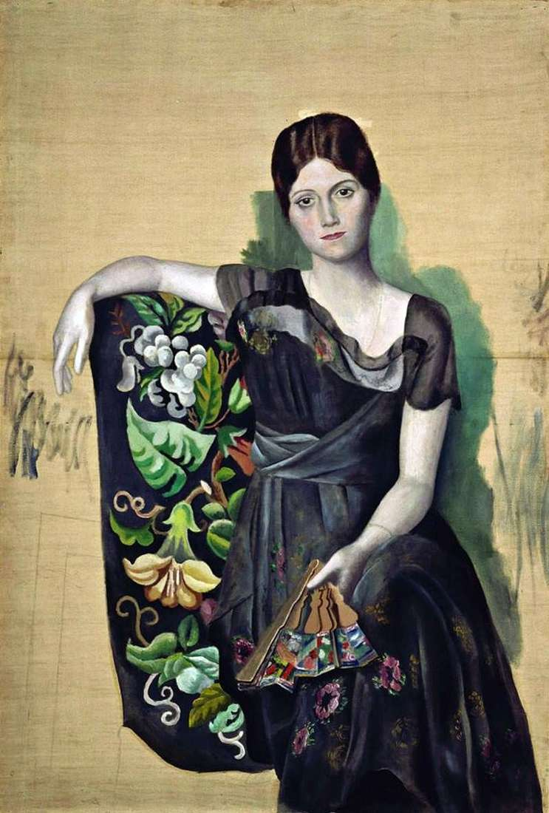

## 基本信息

- 作者：[[毕加索 Pablo Picasso]]
- 创作年代：1918
- 材质：(*not from wiki*) 布面油画
- 尺寸：(*not from wiki*) 130 × 88 cm
- 现存地：(*not from wiki*) Musée Picasso, Paris

## 画面与技法

毕加索 1917-1918 年与 [[俄罗斯芭蕾舞团 Ballets Russes]] 合作期间结识舞团女演员 [[奥尔加 Olga Khokhlova]]，1918 年与之结婚。本作以**新古典主义风格**——非常具象、写实、典雅——把奥尔加描绘成端坐于扶手椅中、手持折扇的优雅女子，背景刻意留白未完成。

是毕加索一战后**放弃立体主义、向古典风回归阶段**的代表作。

## 历史背景

顾衡 067："舞蹈团那么多女演员，为什么毕加索单单看上奥尔加了呢？漂亮当然是重要原因，而另一个原因则是，别看奥尔加是个舞蹈演员，她家正经是个贵族出身。她的这个贵族出身，就为毕加索打开了通往上流社会的通道。"

(*not from wiki*) 奥尔加 (Olga Khokhlova, 1891-1955) 为乌克兰将军之女，1917 年随俄罗斯芭蕾舞团巡演时结识毕加索。两人 1918 年在巴黎结婚、生子 Paulo（1921）；婚姻在 1930 年代毕加索与 [[玛丽·泰莱斯 Marie-Thérèse Walter]] 私通后破裂，但因奥尔加拒绝离婚，两人法律上仍是夫妻直至她 1955 年去世。

## 图片清单

| 编号 | 出自 | 描述 |
|---|---|---|
| 01 | [[067｜毕加索4：什么是综合立体主义？]] | 整体图 |

## 出现在

- [[067｜毕加索4：什么是综合立体主义？]]
