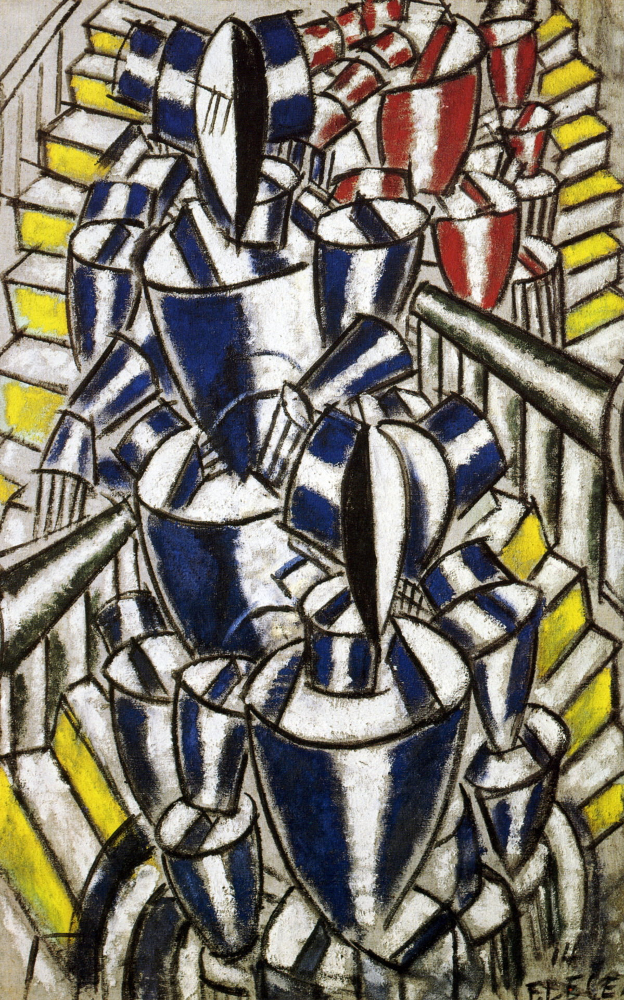

## 基本信息

- 作者：[[莱热 Fernand Léger]]
- 创作年代：1914
- 材质：布面油画 (*not from wiki*)
- 尺寸：约 144 × 118 cm (*not from wiki*)
- 现存地：苏黎世美术馆 (Kunsthaus Zürich) (*not from wiki*)

## 画面与技法

与《[[俄国芭蕾舞团 (莱热) The Exit of Russian Ballet|俄国芭蕾舞团]]》**几乎完全相同的画面**：色块、圆柱、对角线交错。但莱热给它起了完全不同的名字——揭示其根本立场：**对艺术形式有兴趣，对真实世界毫无兴趣**。

顾衡用两幅画的"标题任意性"佐证：**"管子就是一切"**——具体题材对他来说并不重要。

## 历史背景 (*not from wiki*)

是莱热 1913–1914 年"形式对比 (Contrastes de formes)"系列的代表作之一，也是欧洲抽象绘画的早期重要尝试。

## 图片清单

| 编号 | 出自 | 描述 |
|---|---|---|
| 01 | [[068｜立体主义，除了毕加索还值得了解什么？]] | 与《俄国芭蕾舞团》几乎一模一样的"管子拼贴" |

## 出现在

- [[068｜立体主义，除了毕加索还值得了解什么？]] —— 与《俄国芭蕾舞团》构成"标题任意性"范例
