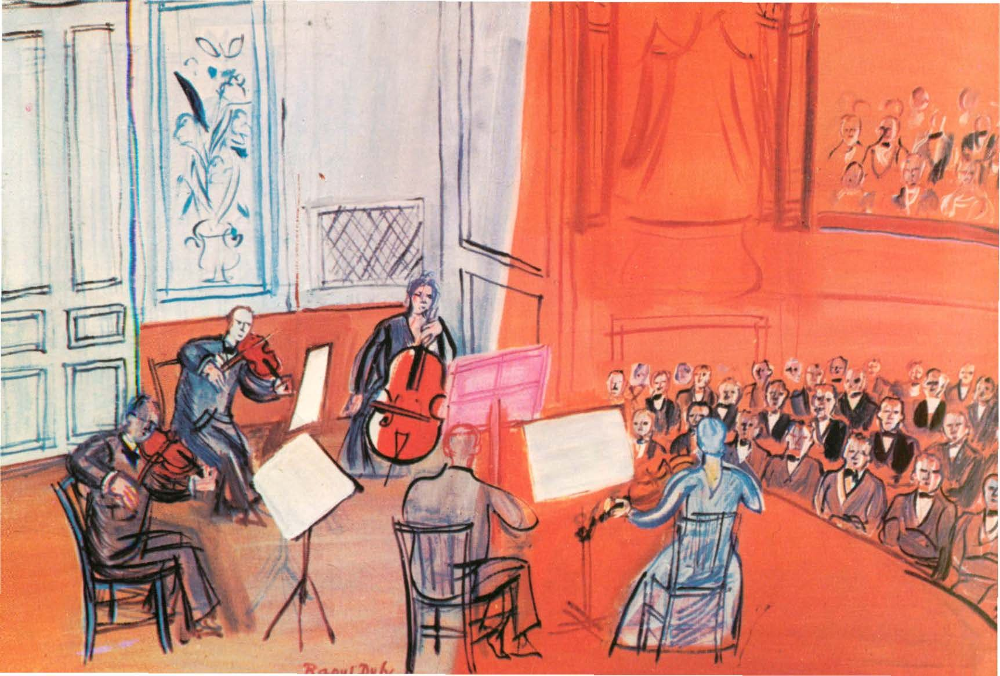

## 基本信息

- 作者：[[杜菲 Raoul Dufy]]
- 创作年代：1948
- 材质：油彩，画布 (*not from wiki*)
- 现存地：(*not from wiki*)

## 画面与技法

[[杜菲 Raoul Dufy]] 1948 年晚期作品，音乐会主题。延续杜菲的两层叠加法——这次主色调被压缩为**单一橙色**铺底，乐手与乐器以杜菲式拙朴线条勾出。

音乐会与管弦乐队是杜菲晚期反复描绘的题材，体现他对**节庆+集体欢愉**场景的偏爱——与顾衡 063 引述杜菲的名言一致：

> 我的眼睛，天生就是用来抹除丑陋的。

## 历史背景 (*not from wiki*)

- 1948 是 [[杜菲 Raoul Dufy]] 去世前 5 年——他自 1930 起即受关节炎困扰，但晚期作品仍维持轻盈装饰风格。
- 音乐会题材与他对场景化、剧场化装饰的偏好相符。

## 图片清单

| 编号 | 出自 | 描述 |
|---|---|---|
| 01 | [[063｜野兽派，除了马蒂斯还能谈什么？]] | 整幅画面——杜菲晚期音乐会主题 |

## 出现在

- [[063｜野兽派，除了马蒂斯还能谈什么？]] —— 顾衡"多放几幅杜菲"5 件之一
