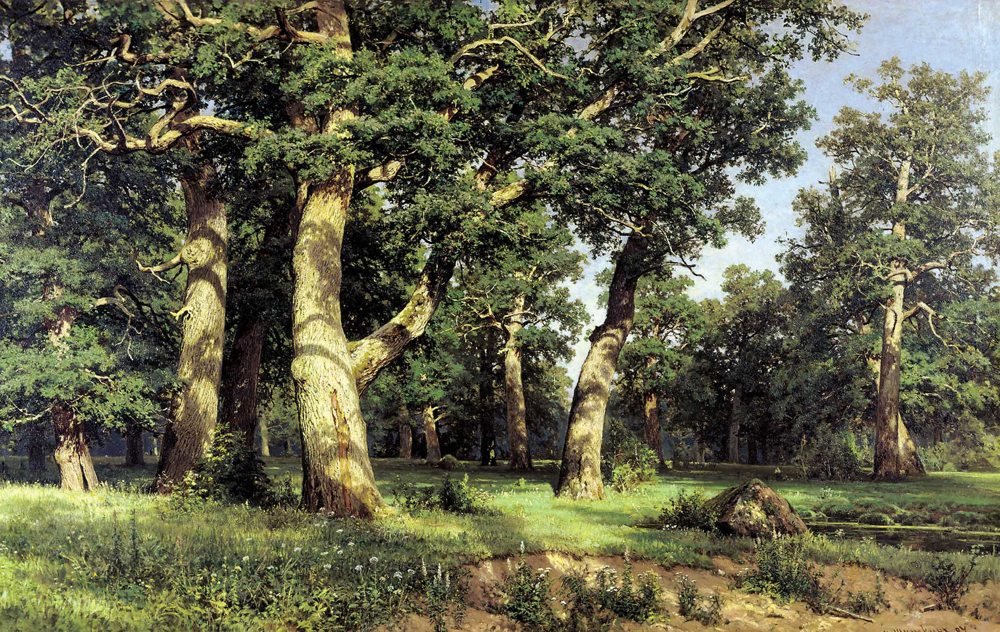

## 基本信息

- 作者：[[施希金 Ivan Shishkin]]
- 创作年代：1887
- 材质：布面油画 (*not from wiki*)
- 尺寸：125 × 193 cm (*not from wiki*)
- 现存地：基辅国家俄罗斯艺术博物馆 (*not from wiki*)

## 画面与技法

[[巡回画派 Peredvizhniki]] 风景画代表作之一，[[施希金 Ivan Shishkin]] 以**极度写实**的手法描绘古老橡树林——枝干粗壮、林间光线斑驳——展现俄罗斯本土自然的雄浑感。

## 历史背景 (*not from wiki*)

施希金是巡回画派最擅长画森林的画家。年轻的 [[马列维奇 Kazimir Malevich]] 在基辅艺术学校求学时深受其影响（顾衡 083 明言），但毕业后转向印象派、新印象主义。

## 图片清单

| 编号 | 出自 | 描述 |
|---|---|---|
| 01 | [[083｜马列维奇：什么是至上主义？]] | 全画 |

## 出现在

- [[083｜马列维奇：什么是至上主义？]]
