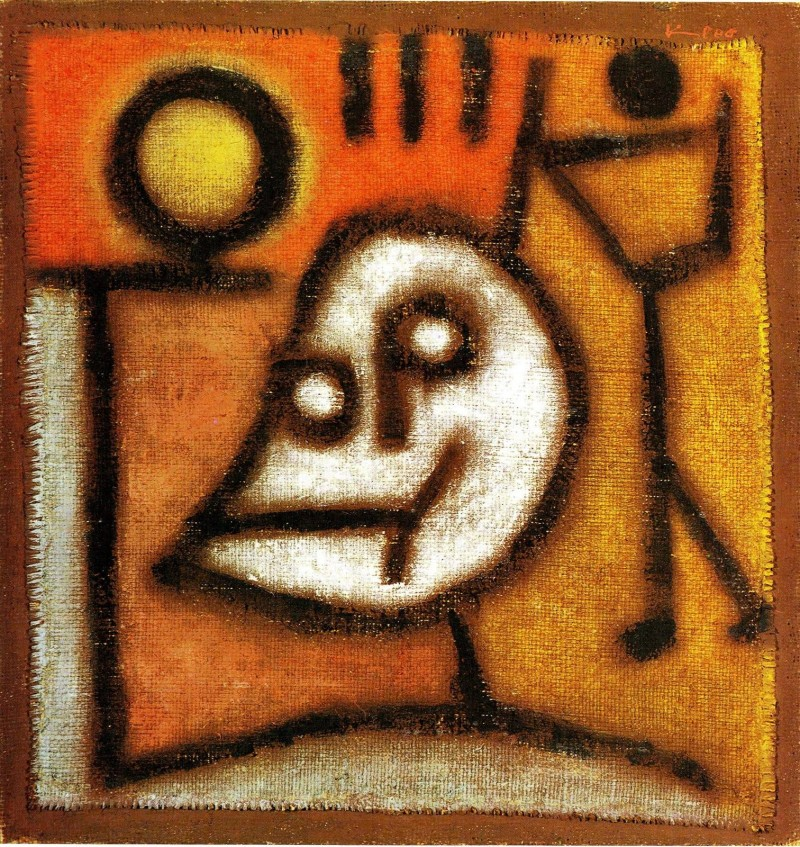

## 基本信息

- 作者：[[克利 Paul Klee]]
- 创作年代：1940
- 材质：油画与彩色糊于黄麻布，裱于黄麻布 (*not from wiki*)
- 尺寸：46 × 44 cm (*not from wiki*)
- 现存地：伯尔尼·保罗·克利中心 (Zentrum Paul Klee) (*not from wiki*)

## 画面与技法

[[克利 Paul Klee]] **最后一幅作品**。本讲解读：

- 画面正中央是个**死神**的形象（脸由"Tod"三个字母构成的图案 (*not from wiki*)），右手托着夕阳——**暗示手一松，夜晚就会降临，死神就把克利带走**
- 右边的小人儿是患了 [[硬皮症 Scleroderma]] 的**克利本人**，**他不耐烦地敲着死神的脑袋**，仿佛在说"快点儿吧，别磨磨蹭蹭的啦！"

这是把画画当作"领着线条散步"的克利，**在死神敲响大门时仍未忘记自己幽默感**的告别之作。完成不久后，克利去世。

## 历史背景

(*not from wiki*) 1940 年克利离开德国回瑞士后的最后阶段。该画与他同年的另一批"末作"被视为 20 世纪艺术中最深刻的死亡冥想之一。

## 图片清单

| 编号 | 出自 | 描述 |
|---|---|---|
| 01 | [[085｜克利：他为什么模仿小孩子画画？]] | 死神托夕阳、小人敲死神脑袋 |

## 出现在

- [[085｜克利：他为什么模仿小孩子画画？]]
