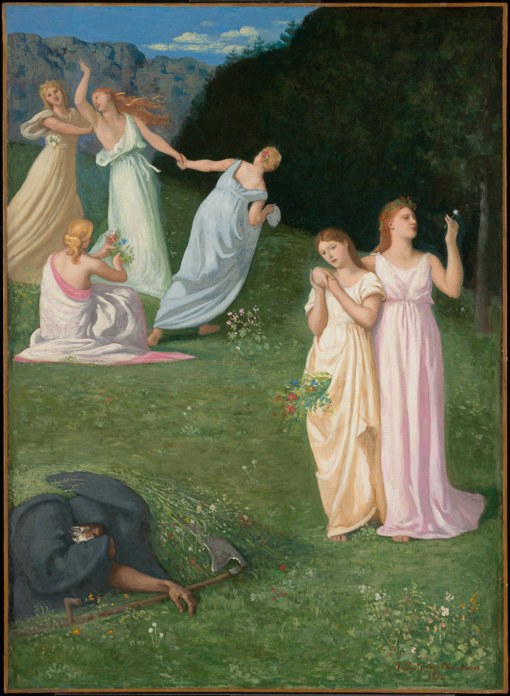

## 基本信息

- 作者：[[夏凡纳 Pierre Puvis de Chavannes]]
- 创作年代：1872
- 材质：油彩、画布 (*not from wiki*)
- 尺寸：(*not from wiki*)
- 现存地：美国马萨诸塞 · 克拉克艺术学院 (Clark Art Institute, Williamstown) (*not from wiki*)

## 画面与技法

**七人构图却仍程式化** 的代表作。**天空被画得很小**，前景人物 **被推向观众** 以产生更强的情绪冲击；**用色含蓄**、画面元素简单、人物造型呈"寓意明确的海报感"——少女们或动或静、表达对生命的热爱，**黑袍老人（象征死亡）则蜷曲在画面的一隅**。

顾衡在 [[049｜夏凡纳：如何制作象征主义的密电码？]] 中以此画印证 [[夏凡纳 Pierre Puvis de Chavannes]] 的自述：**"我必须做到镇定和简单，我必须浓缩、扼要和简化，我要用尽可能少的词汇去表达。"** —— 即使是七人场面，也能保持程式化、避免任何"噪音性"的个人特点。本画也与 [[希望 (夏凡纳) Hope]] 一样 **表达了一种乐观情绪**。

## 历史背景 (*not from wiki*)

"Death and the Maiden / Maidens" 是德语文化圈古老的舞蹈母题 (Totentanz 死亡之舞 的派生题材)。夏凡纳把它处理为 **去戏剧化、静默的程式化构图** —— 与 [[象征主义 Symbolism]] 的 **简化路径** 完全契合。

## 图片清单

| 编号 | 出自 | 描述 |
|---|---|---|
| 01 | [[049｜夏凡纳：如何制作象征主义的密电码？]] | 整幅画面 |

## 出现在

- [[049｜夏凡纳：如何制作象征主义的密电码？]]
