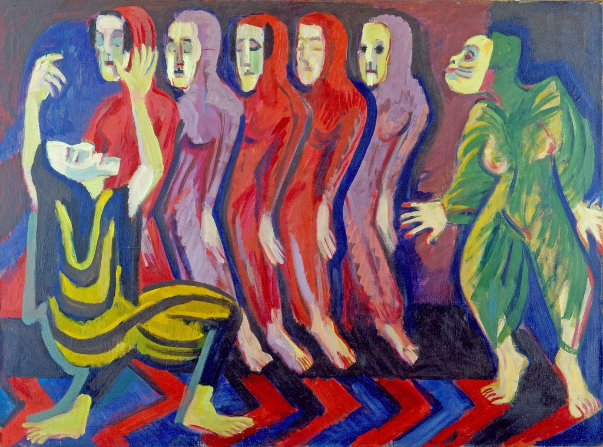

## 基本信息

- **作者**：[[基希纳 Ernst Ludwig Kirchner]]
- **创作年代**：1926
- **材质**：布面油画 (*not from wiki*)
- **尺寸**：暂不详 (*not from wiki*)
- **现存地**：暂不详 (*not from wiki*)

## 画面与技法

- 072 中与 [[街景 (基希纳) Street, Berlin]] 并列举出，作为 [[爱德华·蒙克 Edvard Munch]] **影响痕迹显而易见**的例证：尖尖的造型、阴郁的色调、鬼魅一样的人体。
- "死亡之舞" 是欧洲中世纪起的传统母题——基希纳的处理服务于 [[表现主义 Expressionism]]"民族 + 时代"框架中的 **死亡 / 焦虑** 经验。

## 历史背景 (*not from wiki*)

1926 时基希纳已远离桥社时代——经历一战崩溃、迁居瑞士达沃斯——画面阴郁与晚年精神状态相吻合。

## 图片清单

| 编号 | 出自 | 描述 |
|---|---|---|
| 01 | [[072｜桥社：什么是表现主义绘画的使命？]] | Dance of Death 1926 |

## 出现在

- [[072｜桥社：什么是表现主义绘画的使命？]]
