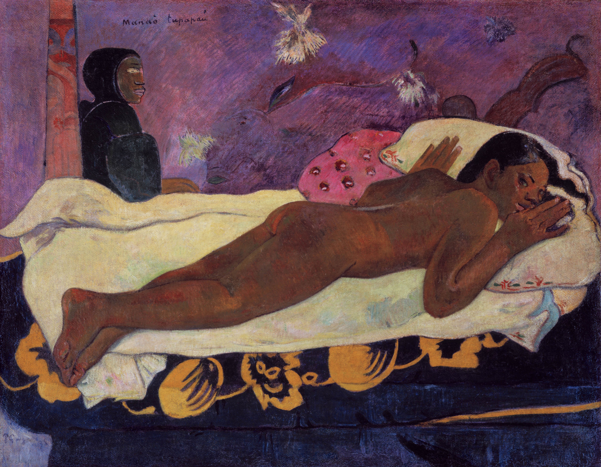

## 基本信息

- 作者: [[高更 Paul Gauguin]]
- 创作年代: 1892
- 材质: 布面油画 (*not from wiki*)
- 尺寸: 73 × 92 cm (*not from wiki*)
- 现存地: 奥尔布赖特-诺克斯美术馆，水牛城 (Albright-Knox Art Gallery, Buffalo) (*not from wiki*)

## 画面与技法

- 画中人为高更的土著妻子 **特霍拉**（Tehura / Teha'amana）。
- 创作来源：顾衡转述高更自述——"**有一天高更回来得很晚，到家后发现特霍拉趴在床上等着他，在黑暗中因为恐惧，眼睛睁得大大的，这景象让高更深受感动。**"
- 高更自述（顾衡 056 引）：
  > 我把她的眼睛画成像听到丧钟时那种昏暗、悲伤和惊恐的表情。画面呈现出紫色、暗蓝色和橘黄色总的和谐……最后我画了一个很普通的幽灵，一个不害人的小老头，为了让她通过幽灵去想象，与死人联系起来，换言之，与她自己的存在联系起来。
- 用塔希提语命名 + 法语注解（*Spirit of the Dead Watching*）。

## 历史背景 (*not from wiki*)

高更塔希提时期最受争议、最常引用的作品之一——西方男性凝视、殖民地权力、原住民身体的复合争议样本。

## 图片清单

| 编号 | 出自 | 描述 |
|---|---|---|
| 01 | [[056｜高更2：象征主义还能走多远？]] | 全图 — 特霍拉俯卧床上，背景幽灵 |

## 出现在

- [[056｜高更2：象征主义还能走多远？]]
