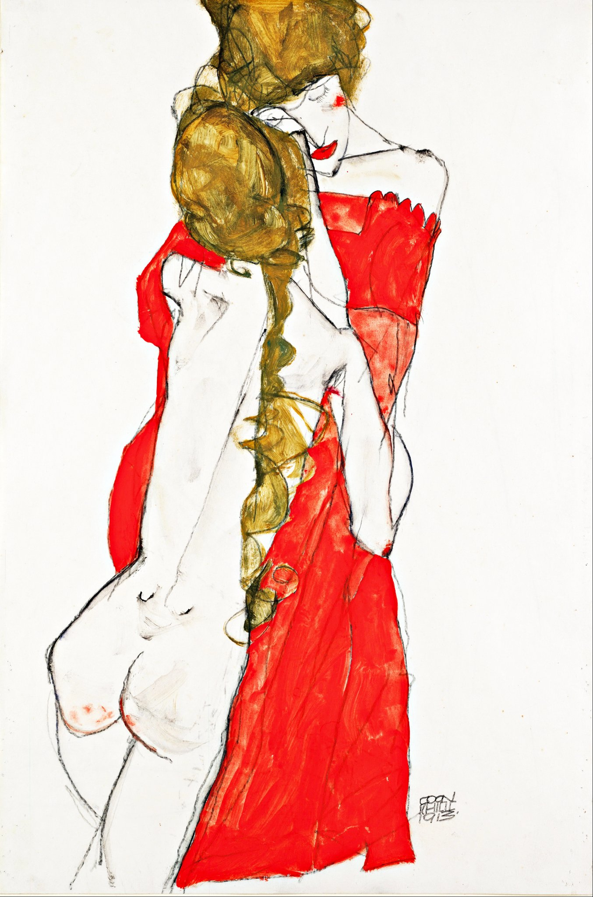

## 基本信息

- **作者**：[[席勒 Egon Schiele]]
- **创作年代**：1913
- **材质**：油彩 / 水彩 (*not from wiki*)
- **现存地**：未注明 (*not from wiki*)

## 画面与技法

席勒**精神分析图像化**系列之另一例（顾衡 075）——母与女的紧张抱拥、人物拉长的形体、苍白的脸色，呈现席勒典型的**瘦长且紧张**的视觉语言。母女主题在席勒笔下既包含他对家庭的渴望，也带有他对女性恐惧的内在矛盾。

## 历史背景 (*not from wiki*)

席勒同主题画作不止一件——艺术史上以"Mother and Child"为题的席勒作品散见于多家收藏机构。

## 图片清单

| 编号 | 出自 | 描述 |
|---|---|---|
| 01 | [[075｜席勒2：为什么他是"最表现主义"的画家？]] | 母女相拥 |

## 出现在

- [[075｜席勒2：为什么他是"最表现主义"的画家？]]
