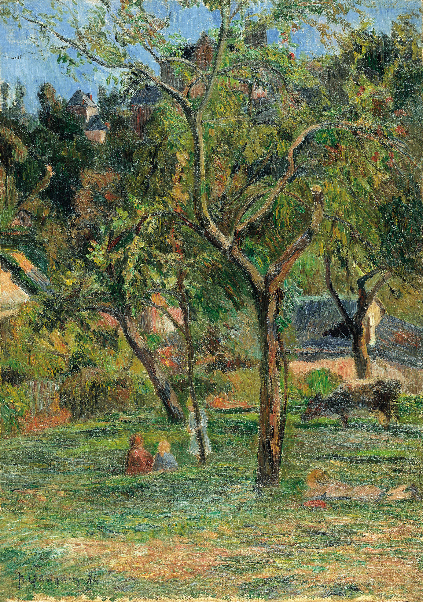

## 基本信息

- 作者: [[高更 Paul Gauguin]]
- 创作年代: 1884
- 材质: 布面油画 (*not from wiki*)
- 尺寸: 年代不详
- 现存地: (*not from wiki*)

## 画面与技法

高更早期印象派阶段作品——延续[[毕沙罗 Camille Pissarro]]的风景题材与小笔触；构图沿用印象派"户外取景"传统。顾衡 055 引为"1882 股灾后高更转职业画家阶段、画风仍紧跟毕沙罗"的样本。

## 历史背景 (*not from wiki*)

1882 巴黎股灾后，高更股票经纪人事业崩溃，把妻儿送回丹麦，全职作画但卖不出画；此画属于该阶段。

## 图片清单

| 编号 | 出自 lecture | 描述 |
|---|---|---|
| 01 | [[055｜高更1：为什么从印象派走向象征主义？]] | 全图 |

## 出现在

- [[055｜高更1：为什么从印象派走向象征主义？]]
