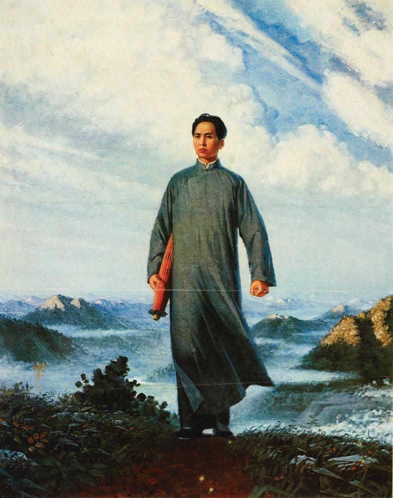

## 基本信息

- 作者：[[刘春华 Liu Chunhua]]
- 创作年代：1967
- 材质：布面油画 (*not from wiki*)
- 尺寸：约 220 × 180 cm (*not from wiki*)
- 现存地：原作藏于中国国家博物馆 (*not from wiki*)
- 累积印刷量：**9 亿余张** —— 是文革中最广泛传播的图像

## 画面与技法

中国文革时期油画。**所有元素都像密电码一样清晰** —— 人物姿态、长袍、手中油纸伞、远景——单独拎出来都能识别为革命叙事的特定意义。是 **舞台剧式标准动作** 在革命题材中的中国版本。

顾衡在 [[049｜夏凡纳：如何制作象征主义的密电码？]] 中用此画作为 **跨文化象征主义样本**——说明 [[象征主义 Symbolism]] **"给每一种思想匹配一个造型"** 的方法论在不同文化语境下都会出现：[[夏凡纳 Pierre Puvis de Chavannes]] 的密电码 vs 刘春华的密电码——本质同构。

## 历史背景 (*not from wiki*)

1921 年青年毛泽东赴安源煤矿（江西萍乡）发动工人罢工的革命叙事题材。刘春华是文革期间中央工艺美院学生，1967 年应"毛泽东思想胜利万岁"展览创作此画。1968 年起累积印刷 9 亿余张，成为文革图像传播的最广远样本。1995 年中国嘉德拍卖会上以 605 万元成交，成为当年最高价中国当代油画。

## 图片清单

| 编号 | 出自 | 描述 |
|---|---|---|
| 01 | [[049｜夏凡纳：如何制作象征主义的密电码？]] | 整幅画面 |

## 出现在

- [[049｜夏凡纳：如何制作象征主义的密电码？]] —— 作为 **跨文化象征主义样本** 被顾衡引用
