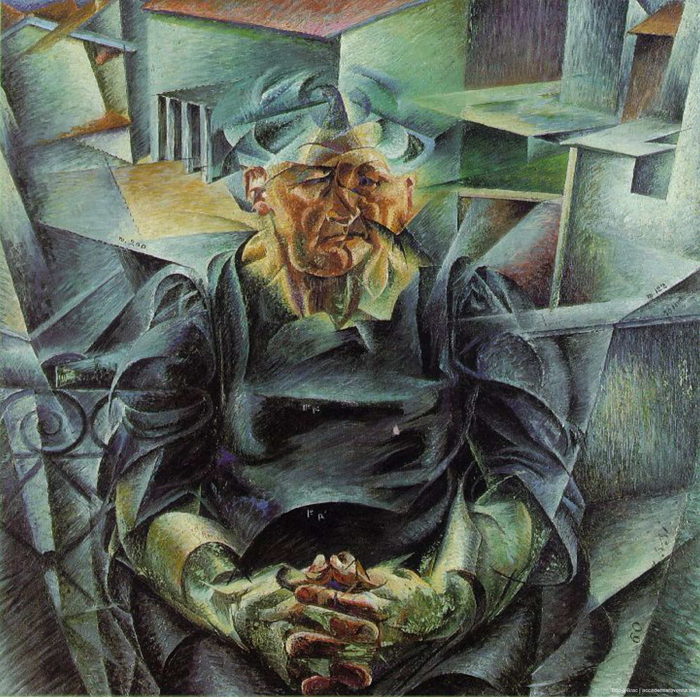

## 基本信息

- 作者：[[波丘尼 Umberto Boccioni]]
- 创作年代：1912
- 材质：布面油画 (*not from wiki*)
- 尺寸：约 95 × 95 cm (*not from wiki*)
- 现存地：私人或意大利公立美术馆 (*not from wiki*)

## 画面与技法

顾衡用这幅画与 [[毕加索 Pablo Picasso]] 的《[[沃拉尔肖像 Portrait of Ambroise Vollard]]》**直接对照**——同样的 [[立体主义 Cubism]] 几何分块语言：
- 毕加索画的人**坐在房间里**
- 波丘尼画的人**坐在汽车里**，"你看五官都吹歪了，汽车跑得多快"

——这就是 [[未来主义 Futurism]] "让立体主义动起来"思路的典型样本。

## 历史背景

(*not from wiki*) 1912 年作于波丘尼接触立体主义之后；该年正是他 1911 巴黎之行回意大利后立体主义+未来主义融合的关键年。

## 图片清单

| 编号 | 出自 | 描述 |
|---|---|---|
| 01 | [[080｜什么是未来主义？]] | 整体图 |

## 出现在

- [[080｜什么是未来主义？]]
