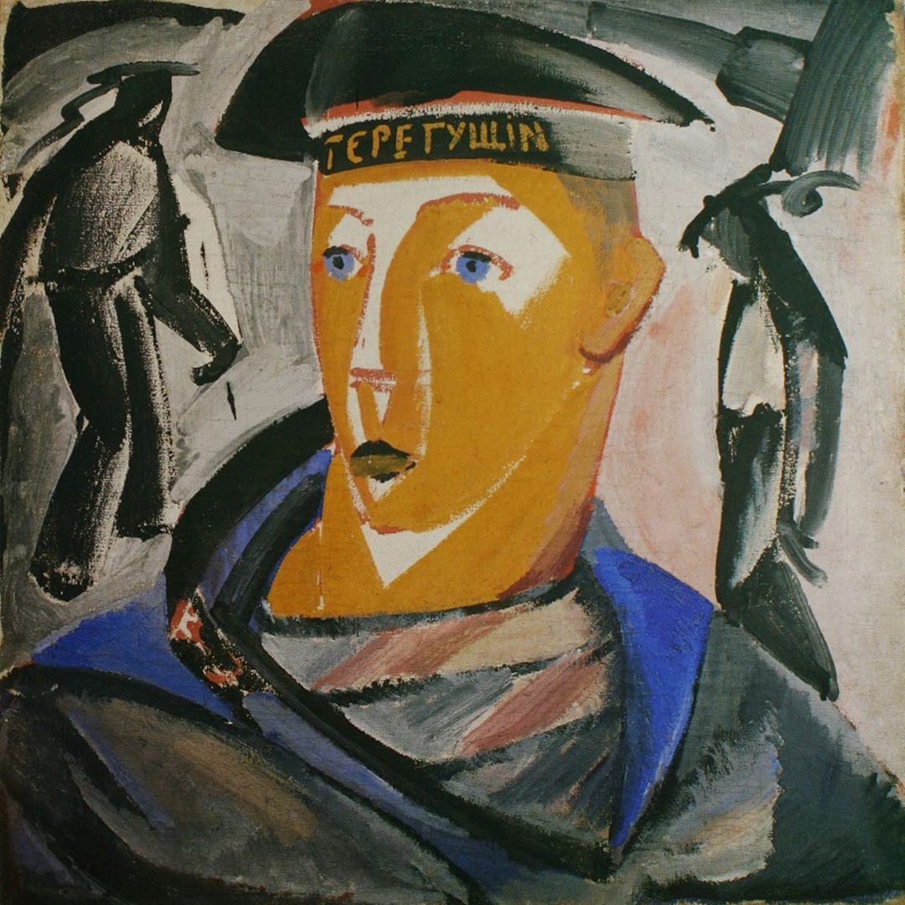

## 基本信息

- 作者：[[塔特林 Vladimir Tatlin]]
- 创作年代：1911–1912
- 材质：布面油画/坦培拉 (*not from wiki*)
- 尺寸：年代不详 (*not from wiki*)
- 现存地：俄罗斯博物馆，圣彼得堡 (*not from wiki*)

## 画面与技法

[[塔特林 Vladimir Tatlin]] 早期作品，亦是其自画像。顾衡 086 把它与 [[女模特 (塔特林) Model]] 并列为塔特林"风格上与 [[马列维奇 Kazimir Malevich]] 相当接近"的样本——同属 **[[立体主义 Cubism|立体主义风格]] 与俄罗斯民俗画的混搭**。

但与马列维奇相比，塔特林**保留了更多的写实主义元素**，"走得没有马列维奇那么远"——见 [[收割者 (马列维奇) Reaper]] 同年的更彻底圆柱体几何分解。

## 图片清单

| 编号 | 出自 | 描述 |
|---|---|---|
| 01 | [[086｜塔特林：什么是构成主义？]] | 全画 |

## 出现在

- [[086｜塔特林：什么是构成主义？]]
