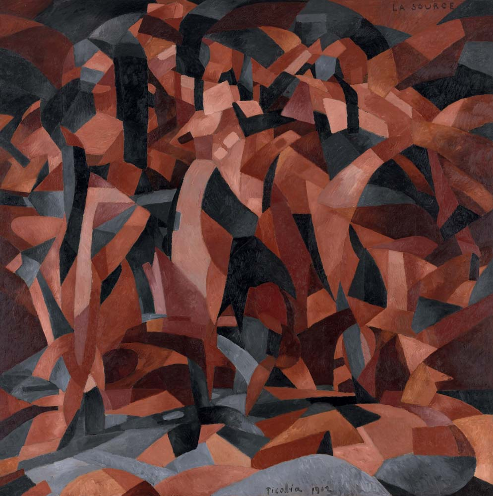

## 基本信息

- 作者：[[毕卡比亚 Francis Picabia]]
- 创作年代：1912
- 材质：布面油画 (*not from wiki*)
- 尺寸：年代不详 (*not from wiki*)
- 现存地：私人收藏 (*not from wiki*)

## 画面与技法

[[毕卡比亚 Francis Picabia]] 1912 年作品，与同年 [[杜尚 Marcel Duchamp]] 的《[[下楼梯的裸女 Nude Descending a Staircase No. 2]]》风格同步——都在尝试用 [[立体主义 Cubism]] / [[未来主义 Futurism]] 的语言表现运动。

**关键对比**：杜尚画的是**同一个人的连续动作**——"未免太未来主义了"——所以被 [[皮托集团 Puteaux Group]] 退回。**毕卡比亚虽然也在表现运动，但好歹他的舞蹈是多人的**——因此本画**被皮托集团接受**了。

## 历史背景

(*not from wiki*) 1912 年这一年是杜尚 / 毕卡比亚二人的关键转折年。

## 图片清单

| 编号 | 出自 | 描述 |
|---|---|---|
| 01 | [[091｜毕卡比亚：如何用绘画表现达达主义？]] | 整体图 — 多人舞蹈的立体主义分解 |

## 出现在

- [[091｜毕卡比亚：如何用绘画表现达达主义？]]
