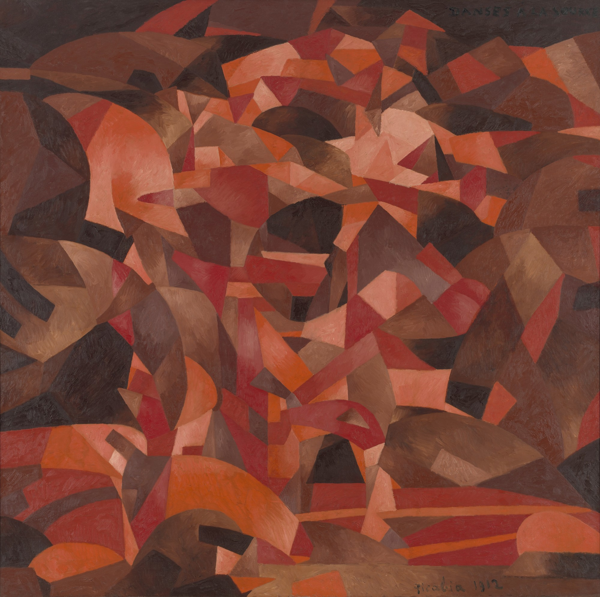

## 基本信息

- 作者：[[毕卡比亚 Francis Picabia]]
- 创作年代：1912
- 材质：布面油画 (*not from wiki*)
- 尺寸：约 252 × 249 cm (*not from wiki*)
- 现存地：纽约现代艺术博物馆 MoMA (*not from wiki*)

## 画面与技法

[[毕卡比亚 Francis Picabia]] 1912 年作品，与《[[水泉 (毕卡比亚) The Spring (Picabia)]]》同主题，同样**多人舞蹈**的[[立体主义 Cubism]] / [[未来主义 Futurism]] 分解——同年也被 [[皮托集团 Puteaux Group]] 接受 (vs 杜尚《下楼梯的裸女》被退稿)。

## 历史背景

(*not from wiki*) 1913 年随毕卡比亚一同送往 [[军械库展览 Armory Show]] (*not from wiki*) 展出，在美国引发关注。

## 图片清单

| 编号 | 出自 | 描述 |
|---|---|---|
| 01 | [[091｜毕卡比亚：如何用绘画表现达达主义？]] | 整体图 — 立体主义分解的多人舞蹈 |

## 出现在

- [[091｜毕卡比亚：如何用绘画表现达达主义？]]
