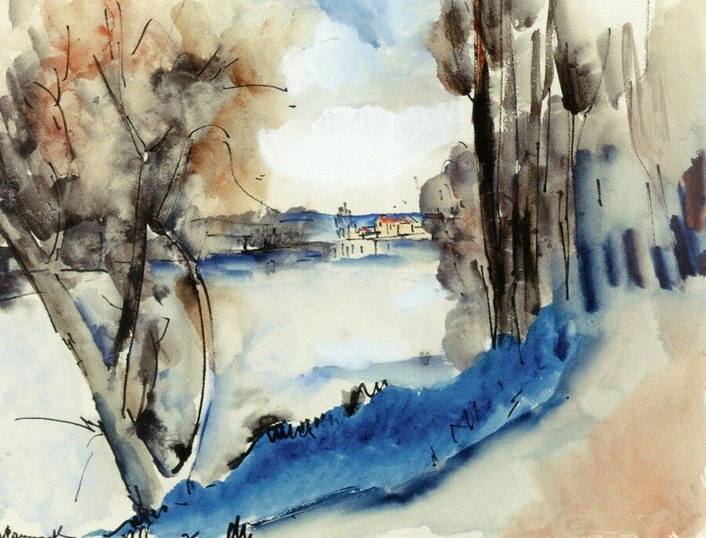

## 基本信息

- 作者：[[弗拉芒克 Maurice de Vlaminck]]
- 创作年代：1908
- 材质：水彩，纸本 (*not from wiki*)
- 现存地：(*not from wiki*)

## 画面与技法

[[弗拉芒克 Maurice de Vlaminck]] 1908 年水彩作品。顾衡 063 评价："**画得真是美，一点儿都不野兽**"——是顾衡自己最喜欢的弗拉芒克作品。

本作显示弗拉芒克**狂放-野兽**之外的另一面：水彩的透明性、克制的笔触、柔和的灰绿/灰蓝色调，与同时期的 [[红树 Landscape with Red Trees]]、[[布吉瓦尔帆船赛 The Regattas in Bougival]] 厚涂炸眼风格形成强烈对照。

## 历史背景 (*not from wiki*)

- 1908 年前后 [[弗拉芒克 Maurice de Vlaminck]] 已开始逐渐告别 [[野兽派 Fauvism]] 的极端阶段——本作可视为他在转型期的内省作品。
- 同年 [[毕加索 Pablo Picasso]] 与 [[勃拉克 Georges Braque]] 正在共同开创立体主义；[[野兽派 Fauvism]] 作为团体行将解体。

## 图片清单

| 编号 | 出自 | 描述 |
|---|---|---|
| 01 | [[063｜野兽派，除了马蒂斯还能谈什么？]] | 整幅画面——水彩 |

## 出现在

- [[063｜野兽派，除了马蒂斯还能谈什么？]] —— 顾衡个人最爱的弗拉芒克作品；"一点儿都不野兽"
