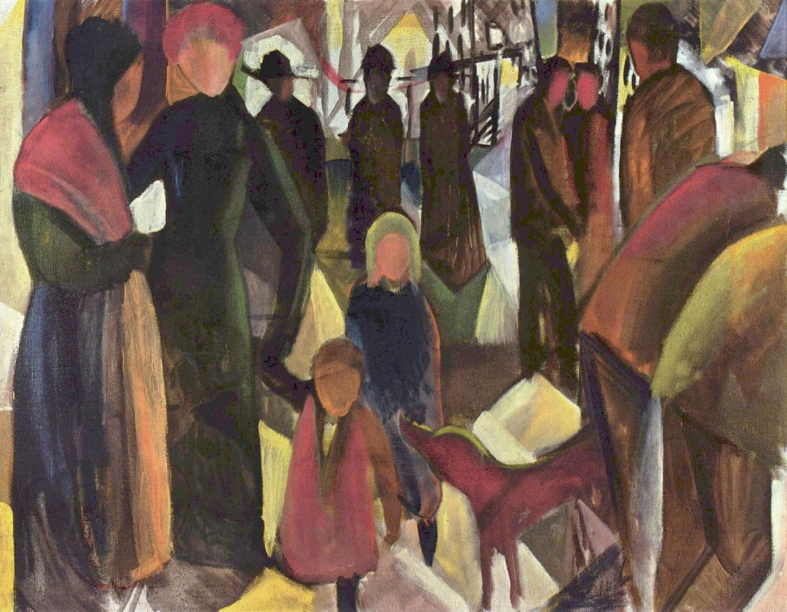

## 基本信息

- 作者：[[马克 August Macke]]
- 创作年代：1914
- 材质：油画 (*not from wiki*)
- 现存地：科隆·路德维希博物馆 (*not from wiki*)

## 画面与技法

[[马克 August Macke]] 1914 年作。本讲指出画面"有着浓浓的 [[爱德华·蒙克 Edvard Munch]] 的影子"——昏暗街景、僵直人形、压抑情绪。

## 历史背景

(*not from wiki*) 一战爆发前夕完成，被普遍视为马克对战争阴影的预感。本讲称之为**"一语成谶"**：马克本人当年即死于香槟战场。

## 图片清单

| 编号 | 出自 | 描述 |
|---|---|---|
| 01 | [[085｜克利：他为什么模仿小孩子画画？]] | 街头送别场景，蒙克式氛围 |

## 出现在

- [[085｜克利：他为什么模仿小孩子画画？]]
