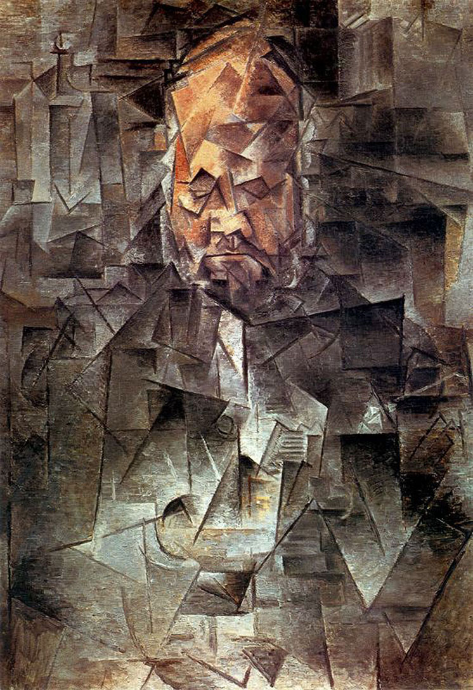

## 基本信息

- 作者：[[毕加索 Pablo Picasso]]
- 创作年代：1910
- 材质：布面油画 (*not from wiki*)
- 尺寸：93 × 66 cm (*not from wiki*)
- 现存地：莫斯科普希金博物馆 Pushkin Museum (*not from wiki*)

## 画面与技法

[[分析立体主义 Analytical Cubism]] 的**入门级** / **可识别度最高**的代表作之一——

- **单色调**：通体只用褐色（与 [[马蒂斯 Henri Matisse]] [[野兽派 Fauvism]] 的"花花绿绿"唱对台戏）。
- **几何拼接**：整个画面用几何形状拼接而成，"就像拼一面碎镜子一样"；有的碎片产生**位移**，有的**翘起来**，在画布上形成变形。
- **可识别度保留**：在人物面部仍加了**颜色提醒**，做出足够辨识线索。
- **轶事**："一个四岁的男孩儿看到这幅画大叫'这是沃拉尔叔叔！'毕加索大为得意，说看！我把他的本质画出来了吧？"——但顾衡随即指出**这恰恰说明本质没画出**（如果真画出本质，外观应该消解）。

[[阿波利奈尔 Guillaume Apollinaire]] 评语："毕加索画画，就像外科医生在做解剖。"

## 历史背景 (*not from wiki*)

- 画中人 [[沃拉尔 Ambroise Vollard]] 是巴黎顶级画商——1895 年为 [[塞尚 Paul Cézanne]] 办了第一次个展、1901 年为毕加索办巴黎首次个展，是毕加索"恩主"型人物。
- 1910 年正值毕加索分析立体主义成熟期；同年还画了 [[卡恩韦勒 Daniel-Henry Kahnweiler]] 像、Wilhelm Uhde 像、[[费尔南德 Fernande Olivier]] 像等几幅同构肖像。
- 由 Sergei Shchukin 或 Ivan Morozov 收藏，后归俄方公立美术馆体系。

## 图片清单

| 编号 | 出自 | 描述 |
|---|---|---|
| 01 | [[066｜毕加索3：什么是分析立体主义？]] | 全图——分析立体主义可识别度最高的代表作 |

## 出现在

- [[066｜毕加索3：什么是分析立体主义？]] —— [[分析立体主义 Analytical Cubism]] 中等抽象度的标杆
