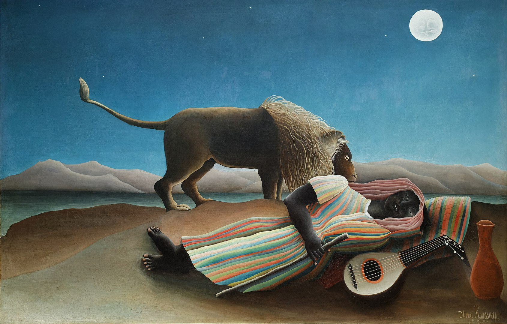

## 基本信息

- 作者：[[亨利·卢梭 Henri Rousseau]]
- 创作年代：1897
- 材质：布面油画 (*not from wiki*)
- 尺寸：129.5 × 200.7 cm (*not from wiki*)
- 现存地：纽约现代艺术博物馆 (MoMA) (*not from wiki*)

## 画面与技法

月夜沙漠中，吉普赛女郎沉睡在地，身旁一只狮子在嗅闻。

顾衡 079 评："和 11 年前的 [[狂欢节之夜 Carnival Evening]] 相比，在技术上卢梭显然没啥进步，还是幼稚的、笨拙的，像小孩子或者原始人画的东西。"——但这恰是他的标志性"质朴 / 原始"画风的成熟期作品。

## 历史背景

创作于 1897 年，距卢梭首次公开亮相已 11 年。彼时他仍是众人眼中的笑柄，但画风未变。本作如今被广泛视为他最重要的早期代表作之一。

## 图片清单

| 编号 | 出自 | 描述 |
|---|---|---|
| 01 | [[079｜亨利·卢梭：毕加索对他的吹捧是真心的吗？]] | 全图：月夜沙漠中睡着的吉普赛女郎与狮子 |

## 出现在

- [[079｜亨利·卢梭：毕加索对他的吹捧是真心的吗？]]
