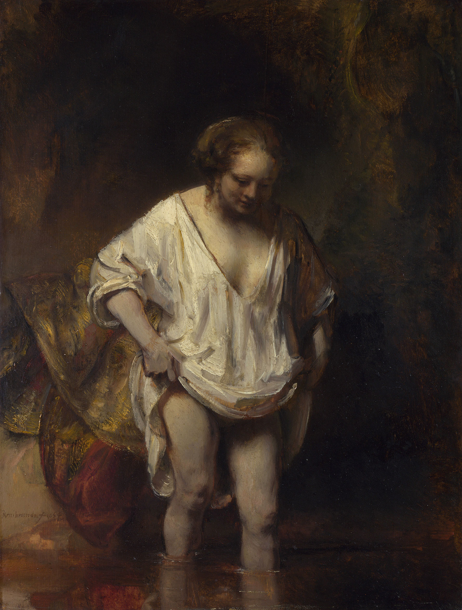

## 基本信息

- 作者：[[伦勃朗 Rembrandt]]
- 创作年代：1654
- 材质：油画 (*not from wiki*)
- 模特：可能是 [[亨德里克金 Hendrickje Stoffels]]
- 现存地：伦敦国家美术馆 (*not from wiki*)

## 画面与技法

构图极简：女人提起白衫涉入溪水。被广泛视为伦勃朗对 [[亨德里克金 Hendrickje Stoffels]] 私密化的描绘——既无大叙事，也无群像装饰，是他后期"研究纯绘画形式"路径的早期代表之一。

## 历史背景

1654 年正是 [[亨德里克金 Hendrickje Stoffels]] 怀孕、被市政委员会传唤的同一年——伦勃朗在公共声誉危机的高峰期画下她个人化的小型沐浴场景，对照 [[拔士巴与大卫王的信 Bathsheba at Her Bath]] 同年画的拔士巴（圣经中通奸怀孕的女性原型），可以看出一对**私生活 ↔ 圣经叙事**的镜像组合。

## 图片清单

| 编号 | 出自 | 描述 |
|---|---|---|
| 01 | [[026｜伦勃朗2：为什么荷兰收费最高的画家会破产？]] | 模特可能是亨德里克金 |

## 出现在

- [[026｜伦勃朗2：为什么荷兰收费最高的画家会破产？]]
