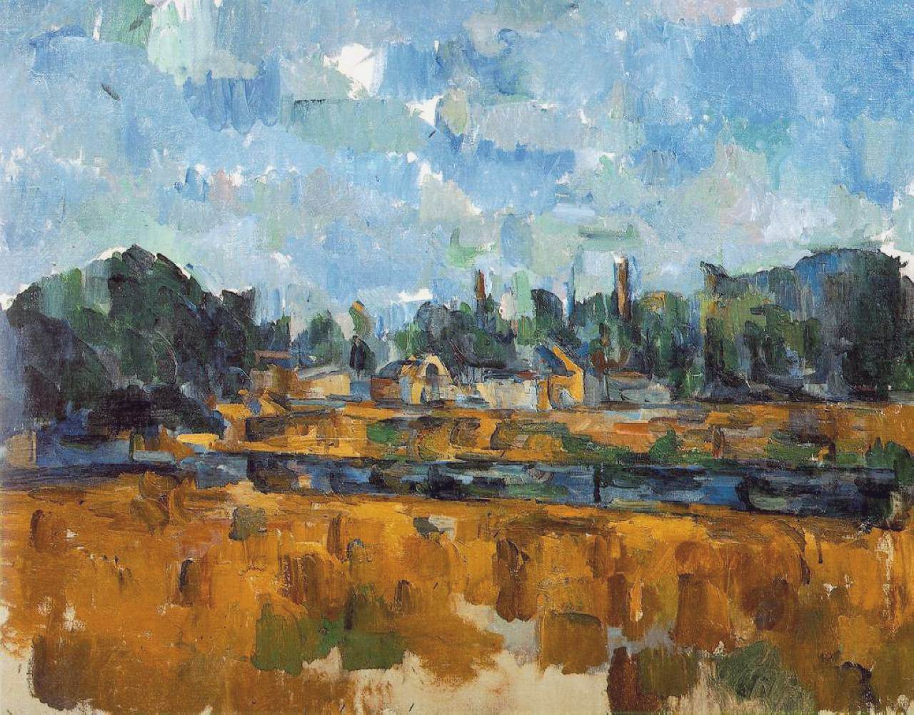

## 基本信息

- 作者：[[塞尚 Paul Cézanne]]
- 创作年代：1905
- 材质：油彩，画布 (*not from wiki*)
- 尺寸：(*not from wiki*) 约 65 × 81 cm
- 现存地：(*not from wiki*) 流转 / 私人收藏

## 画面与技法

[[塞尚 Paul Cézanne]] 晚年（去世前一年）的河岸风景。顾衡 054 与 [[林中的乱石 Rocks in the Wood]] 并列出场，作为塞尚成熟期"颜色塑形 + 几何骨骼"实验的样本——河面、堤岸、树丛被切成相互应和的色块单元，**纵深完全由[[主观色彩序列 Subjective Colour Sequence|主观色彩序列]]承担**、不依靠[[线性透视 Linear Perspective|透视法]]。

## 历史背景 (*not from wiki*)

1905 塞尚已 66 岁、健康衰退（次年 1906 去世）。晚年作品笔触更为松散、颜色更趋透明、几何骨骼隐隐可见——后人称此期为"近抽象 (proto-abstract)"风格。立体主义（毕加索、勃拉克）日后从这一晚期阶段汲取了最核心的灵感。

## 图片清单

| 编号 | 出自 | 描述 |
|---|---|---|
| 01 | [[054｜塞尚3：为什么理解塞尚那么困难？]] | 全图——晚年河岸风景 |

## 出现在

- [[054｜塞尚3：为什么理解塞尚那么困难？]] —— 第三阶段晚年风景
