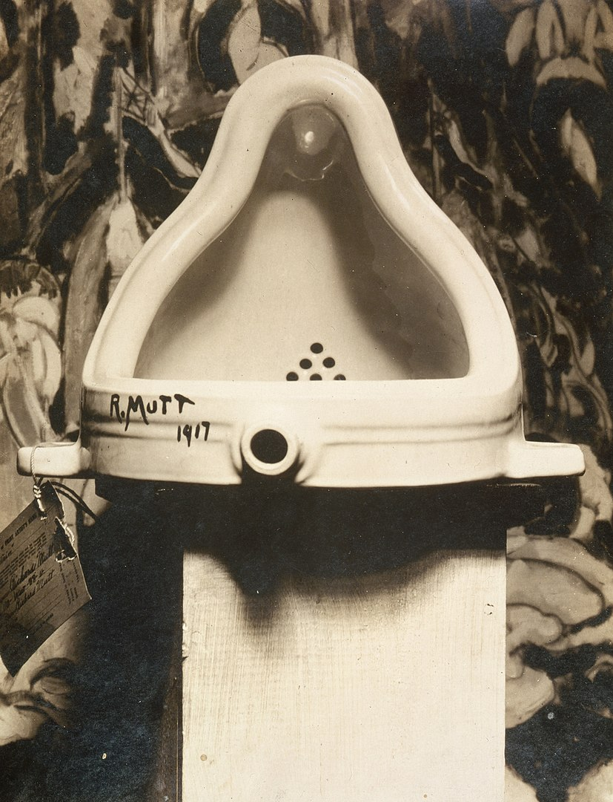

## 基本信息

- 作者：[[杜尚 Marcel Duchamp]]
- 创作年代：1917
- 材质：现成品（瓷质小便器，含 "R. Mutt 1917" 签名） (*not from wiki*)
- 尺寸：约 36 × 48 × 61 cm (*not from wiki*：原件已佚，存世为后续复制品)
- 现存地：原件遗失；多个复制品分藏伦敦泰特、巴黎蓬皮杜、费城美术馆等 (*not from wiki*)

## 画面与技法

杜尚 1917 年的"终极一击"——把一个五金店买来的小便器倒置、签上化名 **"R. Mutt 1917"**、命名《泉》，作为 [[现成品 Readymade]] 的标志性作品送 1917 年纽约[[独立艺术家协会展 Society of Independent Artists Exhibition]]。

**签名 R. Mutt 解码（顾衡 090）**：
- **R** —— 因抽签顺序定下来，R 排最前面（理事会按字母顺序挂画但从随机字母开始，杜尚提议；抽到 R）
- **R** 引向英文常见名 **Richard**，暗含"富有"之意
- **Mutt** —— 当时美国一个卫浴品牌的谐音；又有"傻头傻脑"之意
- 合起来 **R. Mutt = 人傻钱多**

**送展规则漏洞**：协会章程"任何人交 1 美元会费 + 5 美元参展费就可展出两件作品"——"任何人，只要掏了 6 美元，他拿什么来参展组委会都不得拒绝"。

**结果**：理事会吵翻，**6:4 投票判定"这东西根本不是个艺术品，不能展出"**——杜尚和 [[阿伦斯伯格 Walter Arensberg]] 当场退出理事会以示抗议。

但退不退理事会无关痛痒。**真正的大事**——杜尚完成了"终极报复"：彻底颠覆了"艺术"的定义。从此以后，**艺术家的手指指过的东西就成了艺术**（[[迈达斯母题 Midas Motif]]）——艺术家甚至不用创作，他说什么东西是艺术，那东西就成了艺术。

## 历史背景

(*not from wiki*) 1917 年 4 月送展被独立艺术家协会拒收（尽管协会章程是"任何缴费会员皆可参展"）；事件经摄影师 Alfred Stieglitz 留影、阿伦斯伯格夫妇 (Walter & Louise Arensberg) 评论刊登于《盲人》(The Blind Man) 杂志后，演变为 20 世纪现代艺术最重要的"观念革命"事件之一。

杜尚 1913 年笔记里那句决定一切的问题——"**怎么才能做出一件'不算艺术'的作品？**"——经过 1913–1915 的现成品序列实验（[[自行车轮 (杜尚) Bicycle Wheel]] / [[瓶架 (杜尚) Bottle Rack]] / [[提前断臂 In Advance of the Broken Arm]]），最后在《泉》上得到爆炸性的答案：他没能做出"不算艺术的作品"——**而是反过来把所有东西都变成了艺术，于是也彻底毁掉了艺术。**

## 图片清单

| 编号 | 出自 | 描述 |
|---|---|---|
| 01 | [[088｜杜尚1：他"好好画画"是什么样子的？]] / [[090｜杜尚3：他为什么要送一个小便器去参展？]] | 小便器倒置签名 R. Mutt 1917（088 开场预告 + 090 同 URL 复用） |

## 出现在

- [[088｜杜尚1：他"好好画画"是什么样子的？]]（开场预告）
- [[090｜杜尚3：他为什么要送一个小便器去参展？]]（终极一击的完整讨论）
