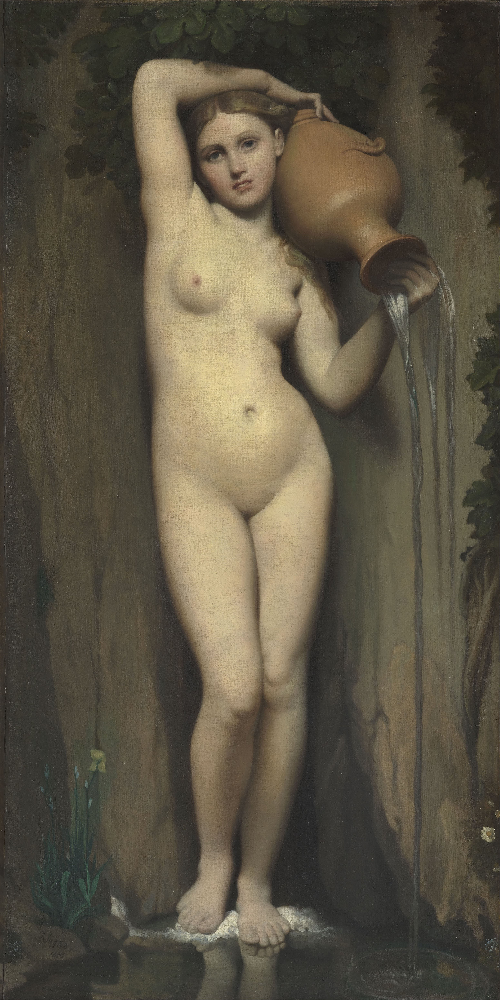

## 基本信息

- 作者：[[安格尔 Jean-Auguste-Dominique Ingres]]
- 创作年代：1856（构思始于 1830）
- 材质：布面油画 (*not from wiki*)
- 尺寸：163 × 80 cm (*not from wiki*)
- 现存地：(*not from wiki*) 巴黎奥赛博物馆 (Musée d'Orsay)

## 画面与技法

**少女立姿全身裸像** —— 头微侧、左肩举水罐、罐口倾出泉水沿肩部、躯干、左腿流下；右手垂落、神情**安详沉静**——背景是青绿岩石与水草。**身躯轮廓极致流畅**——是安格尔毕生求索"女性美的共性"的视觉集大成。

顾衡 032 的核心论断：

> "可以说，**只有安格尔才能把裸女表现得如此动人**。他浸淫于此，达到了无与伦比的境界，以致于被人指责为**流于色情和过于外露**。但是，他笔下人物的神情却是如此安详和沉静，从而再次形成奇妙的对比。"

> "**安格尔笔下的女性，穿着衣服却充满了诱惑，裸着身体却显得十分无辜。**这样的效果，实在是让人难以释怀。"

[[温克尔曼 Johann Joachim Winckelmann]] 的注解被引为本作美学说明：

> "美就像在纯净的源头汲取清水，越是没有味道就越是有益。"

## 历史背景

> 顾衡 032："从 1830 年里，安格尔就开始构思《泉》，长久以来，萦绕在他心头的一个重大问题是：**女性美的深层次共性是什么，以及如何去表达这种共性**。经过多次修改，一直到 1856 年，这个主题才呈现为我们熟悉的样子，**少女举着一只水罐**。"

构思与完成跨度 **26 年** —— 是安格尔毕生美学问题的**最终答案**。本作"大概是我们中国人最熟悉的西方绘画之一"（顾衡 032）。

## 与学院派的"最后绝响"

顾衡 032 的总结判断——**学院派谢幕的内因**：

> "学院派的谢幕固然有政治和文学思潮等外界因素，但是**安格尔在技术上的尽善尽美，也是学院派绘画走向消亡的一个重要原因**。进化论有一句名言：**成功是最大的失败**。物种如此，绘画流派也是如此。"

《泉》正是这一论断的视觉证据 —— 当 [[理念美 Idea of Beauty]] 被推到**安详 + 沉静 + 无辜 + 诱惑**的张力极致，技术上已无可推进，[[学院派 Academic Art]] 也走到了尽头。

## 图片清单

| 编号 | 出自 | 描述 |
|---|---|---|
| 01 | [[032｜安格尔：为什么他是学院派最后一位大师？]] | 整体画面 |

## 出现在

- [[032｜安格尔：为什么他是学院派最后一位大师？]]
