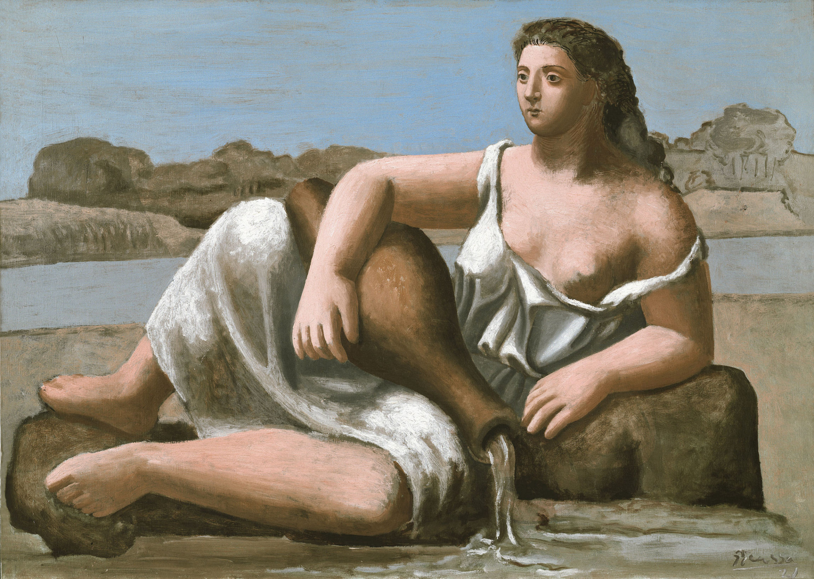

## 基本信息

- 作者：[[毕加索 Pablo Picasso]]
- 创作年代：1923
- 材质：(*not from wiki*) 布面油画
- 尺寸：年代不详
- 现存地：(*not from wiki*) Moderna Museet, Stockholm

## 画面与技法

毕加索一战后**向古典回归阶段**的代表作。一名古典体态的女子半倚卧、举着水罐倾注泉水——形体厚重、比例近乎古希腊雕塑，与战前激进的 [[立体主义 Cubism]] 形成强烈反差。

顾衡 067 用本作说明：1914 年勃拉克参军、毕加索形单影只后即**放弃立体主义、兴趣转回古典绘画风格**——而这种"新古典风"反映的是战争阴影下整个欧洲艺术界对"理性、秩序、传统"的集体回潮。

> 与 [[泉 The Source]]（[[安格尔 Jean-Auguste-Dominique Ingres]] 1856）同名——但毕加索本作不是对安格尔《泉》的直接致敬，而是一战后"回归古典"潮流下广泛的母题。

## 历史背景

(*not from wiki*) 1914-1925 年间被称为毕加索的"新古典主义时期" (Picasso's Neoclassical Period)，受 1917 年罗马、那不勒斯之行影响。其后毕加索又转入超现实主义与综合立体主义混合风格。

## 图片清单

| 编号 | 出自 | 描述 |
|---|---|---|
| 01 | [[067｜毕加索4：什么是综合立体主义？]] | 整体图 |

## 出现在

- [[067｜毕加索4：什么是综合立体主义？]]
