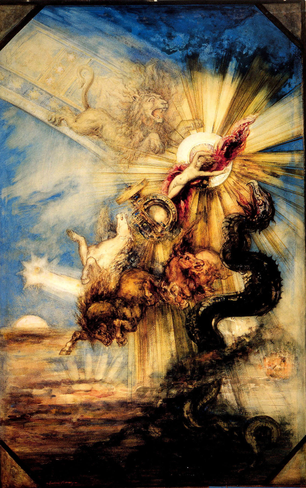

## 基本信息

- 作者：[[莫罗 Gustave Moreau]]
- 创作年代：1878
- 材质：水彩 / 纸本 (*not from wiki*)
- 尺寸：年代不详
- 现存地：(*not from wiki*) 法国 卢浮宫 Musée du Louvre, Paris

## 画面与技法

莫罗"轻真实而重幻想"倾向的典型例证——按希腊神话本来情节，[[法厄同 (莫罗) The Fall of Phaethon|法厄同]]因驾不住父亲赫利俄斯的太阳战车而被宙斯雷击坠落；莫罗却**在天上加上一头狮子，在地上添了一条大蟒蛇**——**根本不在神话剧本里的细节**。这正是莫罗的 [[象征主义 Symbolism]] **朦胧路径**：让"似乎暗示着什么、却没人能说清楚"的细节充塞画面，使主题"变得含混不清"。

## 历史背景

(*not from wiki*) 1878 年——莫罗创作中期，距 1864 沙龙成名作《[[俄狄浦斯与狮身人面像 (莫罗) Oedipus and the Sphinx]]》14 年。此时 [[象征主义 Symbolism]] 文学运动尚未正式宣言（1886），但 [[马拉美 Stéphane Mallarmé]] 等象征主义文人正在塑造"朦胧"美学纲领；莫罗以神话题材＋率性添加无关细节的画风，恰好对应了象征主义者期待的"有意思又猜不透"。

## 图片清单

| 编号 | 出自 | 描述 |
|---|---|---|
| 01 | [[050｜莫罗：象征主义绘画为什么走向朦胧？]] | 1878 全图——天上的狮子、地上的蟒蛇——典型"莫罗式不按剧本添加细节" |

## 出现在

- [[050｜莫罗：象征主义绘画为什么走向朦胧？]]
