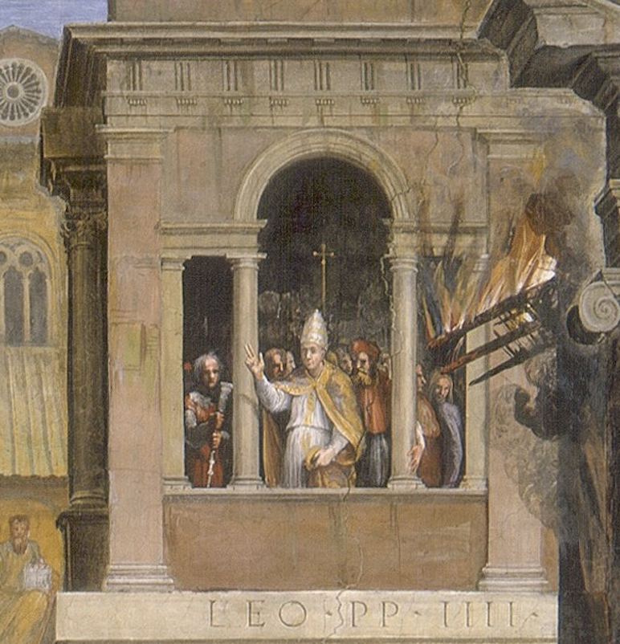

## 基本信息

- 作者：[[拉斐尔 Raphael]]（工作室协作）(*not from wiki*)
- 创作年代：1514 年
- 材质：壁画 (fresco)
- 尺寸：底宽约 670 cm (*not from wiki*)
- 现存地：梵蒂冈宫"波尔哥火灾厅" (Stanza dell'Incendio del Borgo, Palazzi Pontifici, Vaticano) (*not from wiki*)

## 画面与技法

题材：传说中波尔哥村发生火灾，**教皇利奥四世**在阳台上画了个十字，火**神奇地熄灭了**。

形式特征：

- **画面前景**：紧张奔逃、惊呼救火的村民——男性裸体、肌肉发达、姿态雕塑化——**完全像米开朗基罗西斯廷天顶画的人物**。背着老父逃生的青年公然引用古罗马"埃涅阿斯背父出特洛伊"母题。
- **本该站 C 位的教皇**——按主题逻辑应该是画面焦点——却**退到画面深处几乎看不见的小塔楼里**，让位给前景"动感十足的肉块"。
- **顾衡评**："**这紧张的气氛，这雕塑一样的裸体，如果不署名的话，谁会认为这是拉斐尔画的呢？**"

**意义**：这是 [[拉斐尔 Raphael]] 完成 [[雅典学院 The School of Athens]] (1509–10) **仅 4 年后**就向 [[米开朗基罗 Michelangelo]] 风格倾斜的视觉证据——**连拉斐尔本人也未能幸免于矫饰主义的影响**。**对形式的过度强调，不可避免的后果就是主题的模糊与含混**——本该突出的教皇神迹被边缘化。

## 历史背景

(*not from wiki*) 教皇利奥十世委托——这是 *Stanza dell'Incendio del Borgo* 四面壁画中**主壁画**，纪念其前辈利奥四世 (847–855 在位)。题材选择本身亦有政治目的：为利奥十世自比为"灭火止难的教皇"做形象工程。拉斐尔大量交给工作室（特别是 Giulio Romano 的早期参与）执行，是工作室协作体系成熟期作品。

## 图片清单

| 编号 | 出自 | 描述 |
|---|---|---|
| 01 | [[018｜矫饰主义：过度追求形式有什么后果？]] | 整体图 |
| 02 | [[018｜矫饰主义：过度追求形式有什么后果？]] | 局部：前景奔逃的肌肉裸体（米开朗基罗式人物） |

## 出现在

- [[018｜矫饰主义：过度追求形式有什么后果？]]
