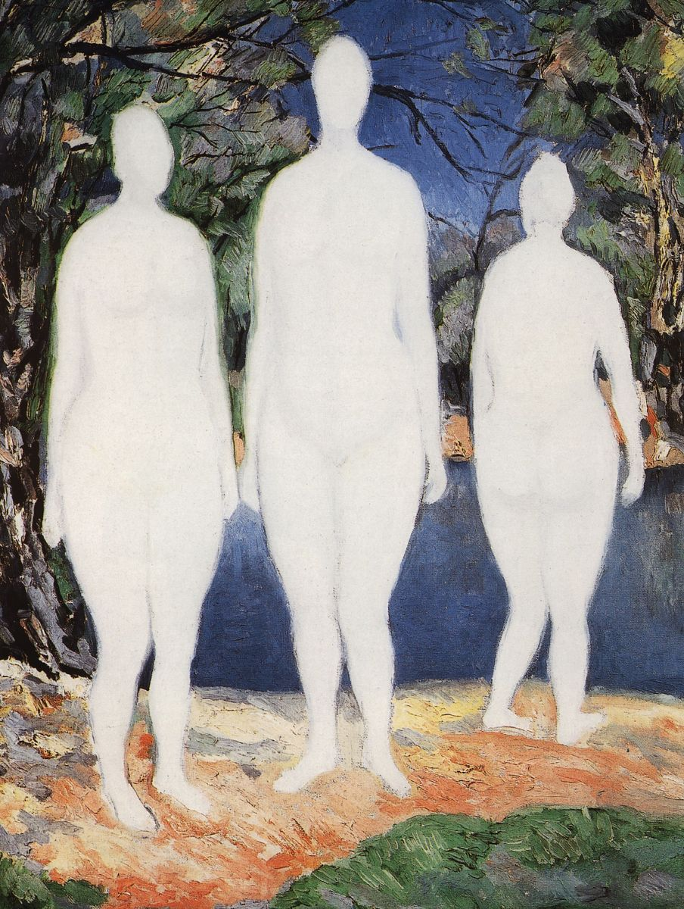

## 基本信息

- 作者：[[马列维奇 Kazimir Malevich]]
- 创作年代：1908
- 材质：布面油画 (*not from wiki*)
- 尺寸：年代不详 (*not from wiki*)
- 现存地：俄罗斯圣彼得堡国立俄罗斯博物馆 (*not from wiki*)

## 画面与技法

顾衡 083：本作显现 [[高更 Paul Gauguin]] 的**象征主义**对 [[马列维奇 Kazimir Malevich]] 的影响——大平涂、勾边、扁平化的人物姿态。

## 图片清单

| 编号 | 出自 | 描述 |
|---|---|---|
| 01 | [[083｜马列维奇：什么是至上主义？]] | 全画 |

## 出现在

- [[083｜马列维奇：什么是至上主义？]]
