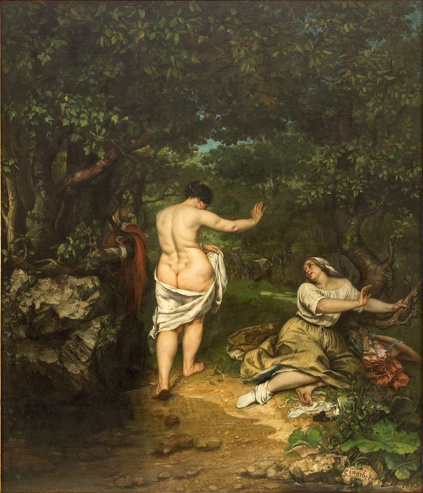

## 基本信息

- 作者：[[居斯塔夫·库尔贝 Gustave Courbet]]
- 创作年代：1853
- 材质：布面油画 (*not from wiki*)
- 尺寸：约 227 × 193 cm (*not from wiki*)
- 现存地：蒙彼利埃法布尔博物馆 Musée Fabre, Montpellier (*not from wiki*)

## 画面与技法

林间溪边——一位**肉感丰满的裸女**背对观者从水中走上岸，举手回望；侧旁穿衣女伴坐地仰望。顾衡 035 关键判语：

> 库尔贝也画裸女。你看一眼就能感觉到，**他画的裸女并不美**。

## 与鲁本斯《美惠三女神》的对照（顾衡 035 核心比较）

- **鲁本斯**《[[美惠三女神 (鲁本斯) The Three Graces (Rubens)]]》：裸女也胖——但鲁本斯**真心认为这样才美**
- **库尔贝**《浴女》：把裸女画成这样——**只是因为模特就长这样**，追求真实；**真实世界里当然有更好看的女人，但我就是要故意画一身赘肉来激怒你们**

同一视觉效果（胖）、**两种意图**（审美 vs 激怒）——顾衡用来揭示库尔贝"硬币反面"的反叛姿态。

## 历史背景

**[[拿破仑三世 Napoleon III]] 真的被激怒了，他用马鞭使劲抽了这幅画一鞭子**（顾衡 035 明示）——这一事件让库尔贝**更出名了**。

**[[德拉克罗瓦 Eugène Delacroix]] 评语**：**"粗俗可鄙"**——浪漫主义旗手对现实主义旗手的"另一端"批评。

## 图片清单

| 编号 | 出自 | 描述 |
|---|---|---|
| 01 | [[035｜库尔贝：为什么现实主义的开创者争议那么大？]] | 林间溪边裸女背身、衣冠女伴坐地 |

## 出现在

- [[035｜库尔贝：为什么现实主义的开创者争议那么大？]]
