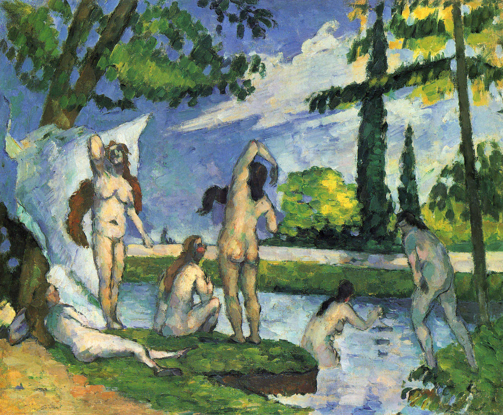

## 基本信息

- 作者：[[塞尚 Paul Cézanne]]
- 创作年代：1874–1875
- 材质：油彩，画布 (*not from wiki*)
- 现存地：(*not from wiki*)

## 画面与技法

[[塞尚 Paul Cézanne]] **浴女母题早期作品**——与同期 [[三个浴女 Three Bathers]] (1874–1875) 一同属于塞尚浴女系列的起点。**线描裸女**为其标志特征。

060 用本作来解释 [[马蒂斯 Henri Matisse]]《[[奢华、宁静与欢乐 Luxury Calm and Pleasure]]》(1904) 的人体来源："**而线描的裸女形象，则显然是取材自塞尚**"——即本作直接成为马蒂斯野兽派前夜混搭画里裸女形态的塑造原型。

## 历史背景 (*not from wiki*)

塞尚一生反复绘制浴女母题——本 1874-75 作与 [[三个浴女 Three Bathers]]、[[四个浴女 Four Bathers]]、晚年 [[浴女们 The Large Bathers]] (Renoir 1887 同名) / 塞尚自己的晚期巨幅《大浴女》(1898–1906) 形成系列。本作展示**线描人体 + 色块块面**的双重训练——既是塞尚自己解决"如何在平面上塑造体积"的练习，也成为马蒂斯等下一代画家的人体范本。

## 图片清单

| 编号 | 出自 | 描述 |
|---|---|---|
| 01 | [[060｜马蒂斯1：野兽派从何而来？]] | 全图——线描裸女、马蒂斯 1904《奢华》人体取材自此 |

## 出现在

- [[060｜马蒂斯1：野兽派从何而来？]]
