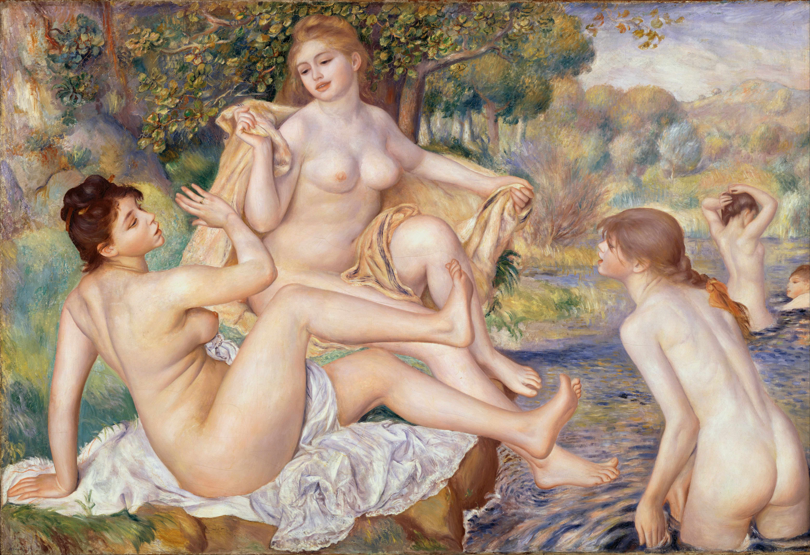

## 基本信息

- 作者：[[雷诺阿 Pierre-Auguste Renoir]]
- 创作年代：1887
- 材质：布面油画 (*not from wiki*)
- 尺寸：117.8 × 170.8 cm (*not from wiki*)
- 现存地：费城艺术博物馆 Philadelphia Museum of Art (*not from wiki*)

## 画面与技法

雷诺阿"安格尔主义"阶段最雄心勃勃的代表作之一——耗时约三年 (1884–1887)、做了大量素描准备、追求**清晰轮廓 + 古典构图**——是 043 顾衡讨论"雷诺阿晚期作品背弃印象派理念"的关键证据。

043 顾衡的关键判语："**雷诺阿晚期作品早已背弃了印象派的理念，这也导致了很多人对印象派绘画理解上的困难**。"——意指：很多人通过雷诺阿晚期画风入门，反而误以为印象派 = 雷诺阿的甜美裸女。

画面三位前景裸女源自 [[凡尔赛宫]] 的吉拉东 (François Girardon) 17 世纪浮雕《沐浴的仙女》(*not from wiki*)——雷诺阿明确借用学院派 / 古典原型，是与印象派"看见什么画什么"原则的最显眼决裂。

## 历史背景 (*not from wiki*)

模特包括雷诺阿未来妻子艾琳·夏里戈以及苏珊·瓦拉东 (Suzanne Valadon, 后成画家)。本作 1887 年展出于乔治·珀蒂画廊 (Georges Petit) 引起印象派内部分裂——莫奈、毕沙罗等老战友对雷诺阿的转向公开不满。

## 图片清单

| 编号 | 出自 | 描述 |
|---|---|---|
| 01 | [[043｜雷诺阿：妥协如何造就大师？]] | 全图，三位前景裸女 |

## 出现在

- [[043｜雷诺阿：妥协如何造就大师？]]
