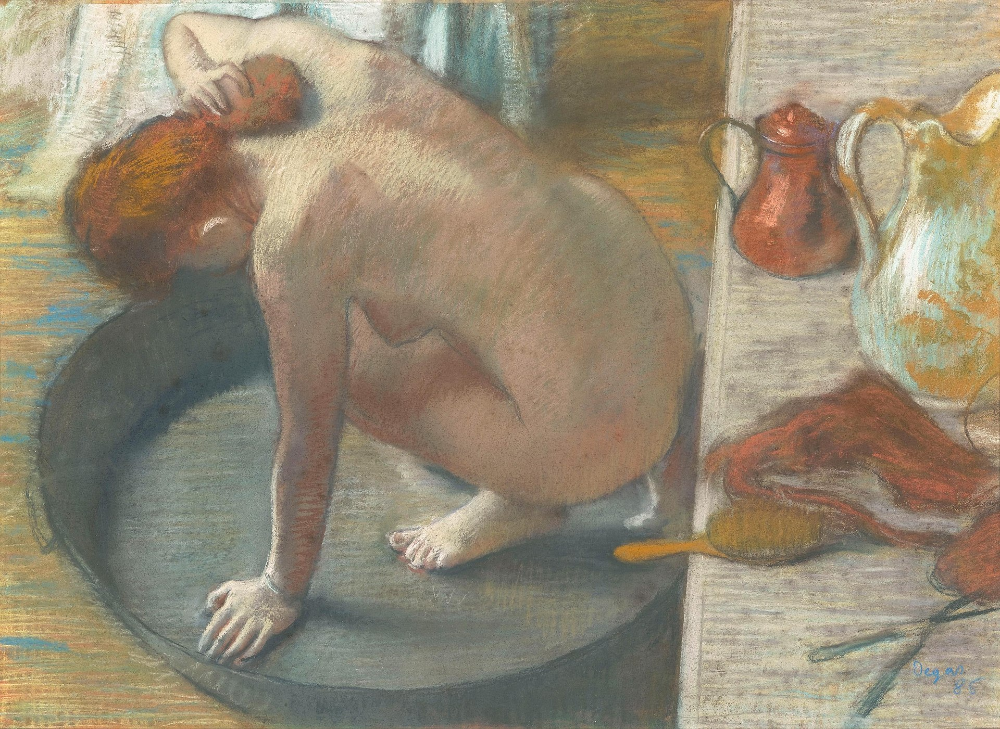

## 基本信息

- 作者：[[德加 Edgar Degas]]
- 创作年代：1886
- 材质：纸上粉彩 (*not from wiki*)
- 尺寸：60 × 83 cm (*not from wiki*)
- 现存地：(*not from wiki*) 巴黎奥赛博物馆 Musée d'Orsay

## 画面与技法

**俯视视角**——裸女蹲在浅浴盆中、左手扶盆沿、右手洗颈——画面右半部为搁置毛巾、水罐的桌面。**没有脸**——只有背影 / 颈背的曲线。

045 顾衡明示：在浴女系列中德加"刻意回避了模特的脸。因为他不想表现任何个性化的东西，更不想用作品表现情感"——这与他在芭蕾舞女中"萃取女性身体所特有的线条系统"是同一方法论。

## 历史背景

045 顾衡指出：在 1886 年印象派第八次（最后一次）画展上展出。该展览中德加贡献了一组"浴女"作品，引起评论界震动——既被赞美其形式纯粹，也被批评（如 [[凡·高 Vincent van Gogh]] 的"性无能"指控）认为是"刻毒地羞辱女性"——顾衡评 [[凡·高 Vincent van Gogh]] 的解读"非常浅薄"。

## 图片清单

| 编号 | 出自 | 描述 |
|---|---|---|
| 01 | [[045｜德加：为什么印象派以他结束？]] | 蹲坐浴盆中的浴女背影 |

## 出现在

- [[045｜德加：为什么印象派以他结束？]]
