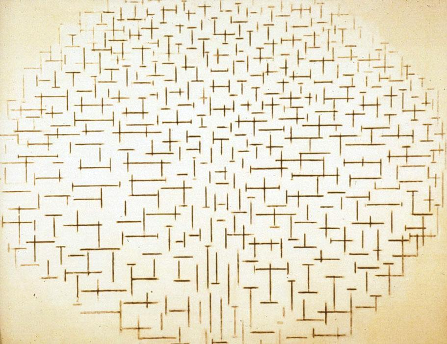

## 基本信息

- 作者：[[蒙德里安 Piet Mondrian]]
- 创作年代：1915
- 材质：(*not from wiki*：布面油画)
- 尺寸：(*not from wiki*：约 85 × 108 cm)
- 现存地：(*not from wiki*：奥特罗 Kröller-Müller Museum)

## 画面与技法

蒙德里安"首次形成自己明确的风格"的关键节点——把一切物象简化为**短的横线条和竖线条**。画面由密布的水平 / 垂直十字短线组成，分布密度模拟海面波纹与防波堤的水平延伸。

按顾衡的判定，这幅画**仍然不能被称为抽象画**：因为名字的提醒下，观者还能看出"海和堤的联系"——画家的意图仍然指向具象。但形式语言已经为下一步（[[新造型主义 Neo-Plasticism]]）做好了铺垫。

## 历史背景 (*not from wiki*)

回到荷兰之后、一战与法国失去联系反而促成蒙德里安形成个人风格。本作所在的"码头与海"系列是其抽象语言的实验室。

## 图片清单

| 编号 | 出自 | 描述 |
|---|---|---|
| 01 | [[084｜蒙德里安：他为什么要画那么多格子？]] | 海堤与海 构成十号（1915） |

## 出现在

- [[084｜蒙德里安：他为什么要画那么多格子？]]
