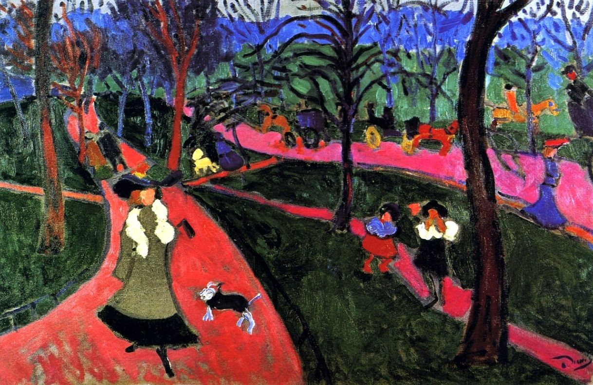

## 基本信息

- 作者：[[德朗 André Derain]]
- 创作年代：1906
- 材质：油彩，画布 (*not from wiki*)
- 现存地：(*not from wiki*)

## 画面与技法

[[德朗 André Derain]] 1906 年伦敦系列。本作被顾衡 063 作为 [[德朗 André Derain]] **"塞尚式分节"延续性** 的样本——即便已进入 [[野兽派 Fauvism]] 时期，**德朗与传统的学院派保持着更好的延续性**（顾衡 063："革命没那么彻底"），很多作品仍体现出 [[塞尚 Paul Cézanne]] 式的 [[分节 (塞尚) Passage|分节]] 性 (passage)——色块以可见笔触为骨架、彼此衔接而不强行融合。

色域以**冷色调**为主——与 [[马蒂斯 Henri Matisse]] 的暖色偏爱形成对照。

## 历史背景 (*not from wiki*)

- 同属 [[德朗 André Derain]] 1906 伦敦组画——画商沃拉尔 (Ambroise Vollard) 委托项目。
- 顾衡 063 用本作 + [[威斯敏斯特大桥 Westminster Bridge]] 一对来论证 "德朗保留了更多的塞尚在他的作品中"。

## 图片清单

| 编号 | 出自 | 描述 |
|---|---|---|
| 01 | [[063｜野兽派，除了马蒂斯还能谈什么？]] | 整幅画面——1906 伦敦组画 |

## 出现在

- [[063｜野兽派，除了马蒂斯还能谈什么？]] —— 作为德朗 "塞尚式分节延续性" 的样本
