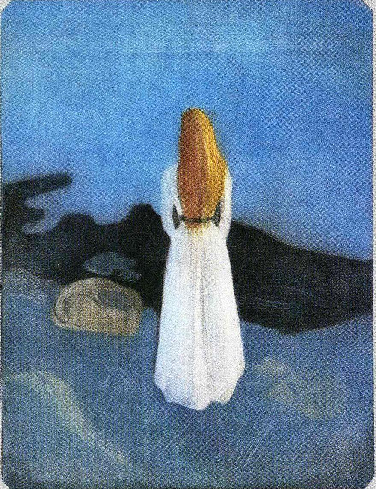

## 基本信息

- 作者：[[爱德华·蒙克 Edvard Munch]]
- 创作年代：1896
- 材质：彩色蚀刻 / 美柔汀 (mezzotint) (*not from wiki*)
- 现存地：多版本流传，多家美术馆藏 (*not from wiki*)

## 画面与技法

顾衡 [[071｜蒙克2：为什么他是表现主义之父？]] 把它与 [[夏夜 Summer Night's Dream]] 并举——蒙克 1895 年以前作品，**受 [[夏凡纳 Puvis de Chavannes]] 影响显而易见**，属 [[象征主义 Symbolism]] 阶段，**不是** [[表现主义 Expressionism]]。

## 历史背景 (*not from wiki*)

亦名《孤独的人》The Lonely One；蒙克版画产量极大，此件以其忧郁的剪影式造型、单色调成为代表作之一。

## 图片清单

| 编号 | 出自 | 描述 |
|---|---|---|
| 01 | [[071｜蒙克2：为什么他是表现主义之父？]] | 海滩边背影少女 |

## 出现在

- [[071｜蒙克2：为什么他是表现主义之父？]]
