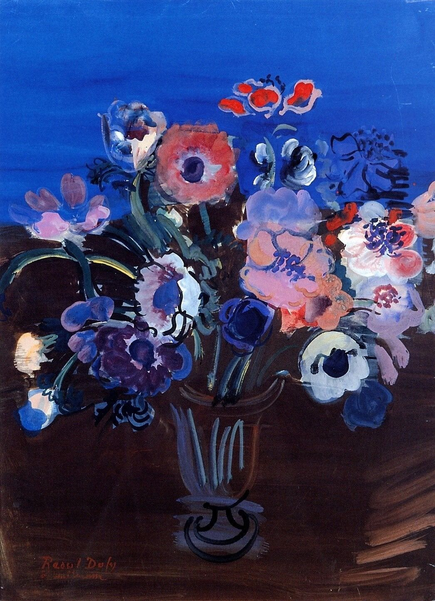

## 基本信息

- 作者：[[杜菲 Raoul Dufy]]
- 创作年代：1938
- 材质：油彩，画布 (*not from wiki*)
- 现存地：(*not from wiki*)

## 画面与技法

[[杜菲 Raoul Dufy]] 1938 年作品。**注**：法语 anémones / 英语 anemones 既可指海葵也可指银莲花（陆生花卉），杜菲的多幅同名作品实际描绘的是**银莲花**（盛行装饰花卉题材）；中文原翻为"海葵"是直译误读。本 wiki 保留顾衡 063 给定的中文标题"海葵"作为 page name，将更准确的"银莲花"列入 aliases。

延续杜菲两层叠加法——明快薄涂色域 + 简率装饰性线条。

## 历史背景 (*not from wiki*)

- 银莲花/海葵题材是 [[杜菲 Raoul Dufy]] 1930 后期反复描绘的静物对象。
- 1938 年同样产出多件城市风景作品 (含 [[威尼斯拉多加纳 Venise La Dogana]])。

## 图片清单

| 编号 | 出自 | 描述 |
|---|---|---|
| 01 | [[063｜野兽派，除了马蒂斯还能谈什么？]] | 整幅画面 |

## 出现在

- [[063｜野兽派，除了马蒂斯还能谈什么？]] —— 顾衡"多放几幅杜菲"5 件之一
