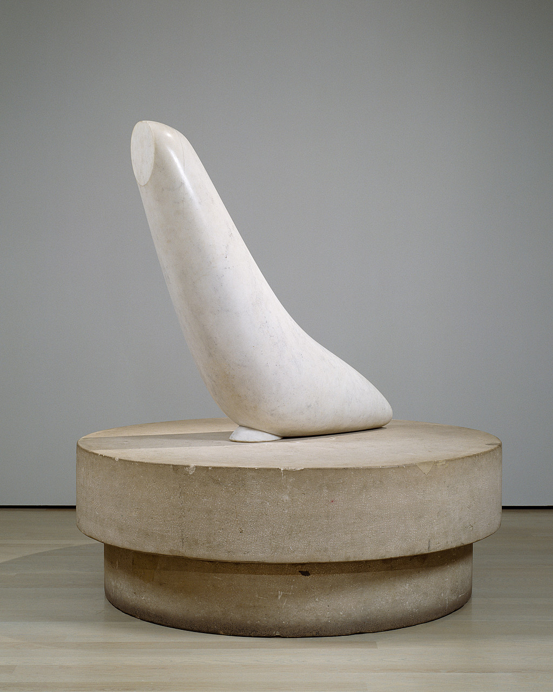

## 基本信息

- 作者：[[布朗库西 Constantin Brâncuși]]
- 创作年代：raw 标注 1876（**与布朗库西生卒 1876–1957 矛盾**，疑为 caption 错误；多数文献将《Seal》系列定于 1924–1943 间）(*not from wiki*)
- 材质：大理石 (*not from wiki*)
- 尺寸：(*未知*)
- 现存地：(*未知*)

> ⚠️ raw 配图标注年份"1876"为布朗库西出生年，几可断定是 caption 错配。本页保留 raw 标注但加注疑问。

## 画面与技法

顾衡 078 把 [[布朗库西 Constantin Brâncuși]] 定位为"**柏拉图的小迷弟**"——一门心思钻研各种事物的"**原型**"。《海豹》和 [[鱼 (布朗库西) Fish]] 是**"透过现象看本质"**思路的妥妥代表：**对原型的追求，其结果必然是对细节的抛弃和简化**。

打磨光滑的大理石曲面，去除了海豹身上一切可识别的局部特征（眼、鳍、纹理），只留下流线型团块——观者一眼即识"海豹"，但又不指向任何具体的海豹。

## 历史背景 (*not from wiki*)

布朗库西的"原型"母题深刻影响了 [[莫迪里阿尼 Amedeo Modigliani]]——078 课正以此说明莫迪里阿尼从绘画转向雕塑、再回到绘画后形成"长鼻子、空白眼"标志风格的内在思想脉络。

## 图片清单

| 编号 | 出自 | 描述 |
|---|---|---|
| 01 | [[078｜莫迪里阿尼：画中女子为什么让人一眼难忘？]] | 流线型大理石海豹 |

## 出现在

- [[078｜莫迪里阿尼：画中女子为什么让人一眼难忘？]]
