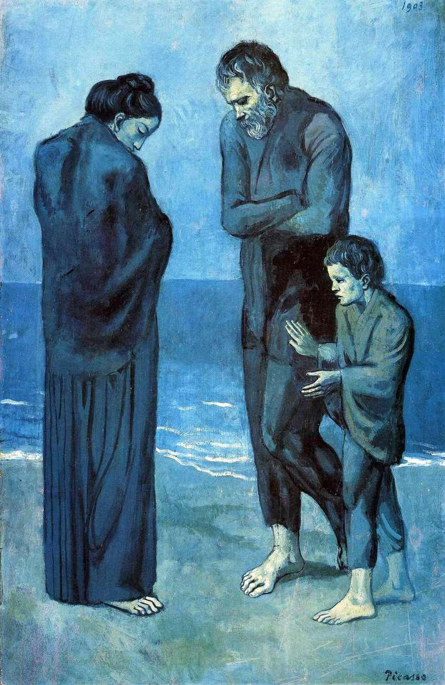

## 基本信息

- 作者：[[毕加索 Pablo Picasso]]
- 创作年代：1903
- 材质：木板油画 (*not from wiki*)
- 尺寸：105.4 × 69 cm (*not from wiki*)
- 现存地：华盛顿美国国家美术馆 (National Gallery of Art, Washington) (*not from wiki*)

## 画面与技法

[[蓝色时期 Blue Period]] 定型阶段的"强烈同质性"样本之一——三个赤足赤臂的人物（成年男女各一加孩童）站在荒凉海滩上，眼神低垂、动作凝固成 [[埃尔·格列柯 El Greco]] 式的舞台定格。

风格特征与 [[老吉他手 The Old Guitarist]] 一致：[[夏凡纳 Pierre Puvis de Chavannes]] 式简化 + 矫饰主义拉长四肢 + 单色调蓝色饱和。

英文常作 *The Tragedy*。

## 历史背景 (*not from wiki*)

- 创作于巴塞罗那 1903 年——X 射线显示画下至少有三层早期构图被覆盖。
- 与 [[老吉他手 The Old Guitarist]]、[[两姐妹 (毕加索) The Two Sisters (Picasso)]] 同属蓝色时期"社会底层 / 边缘人"母题群。

## 图片清单

| 编号 | 出自 | 描述 |
|---|---|---|
| 01 | [[064｜毕加索1：如何理解"蓝色时期"和"玫瑰红时期"？]] | 整幅画面 |

## 出现在

- [[064｜毕加索1：如何理解"蓝色时期"和"玫瑰红时期"？]]
