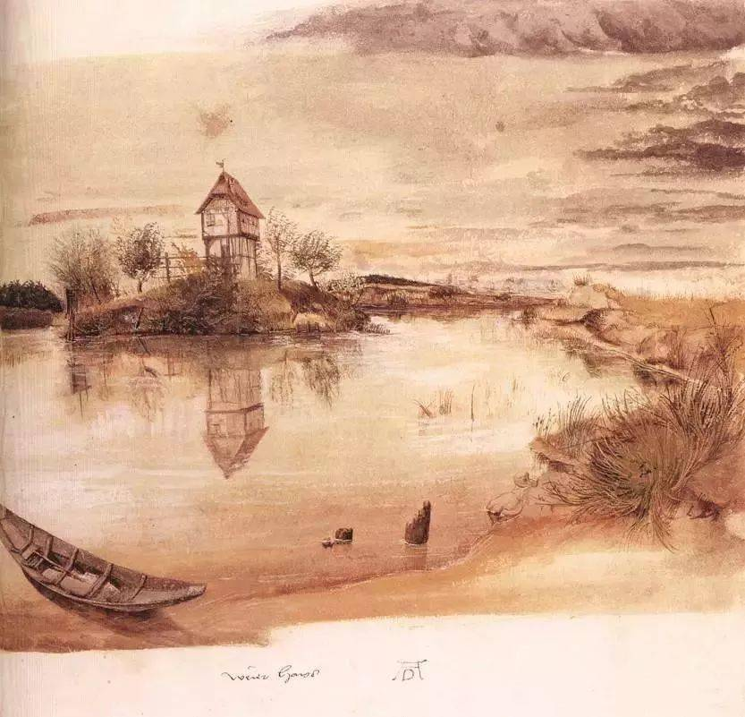

## 基本信息

- 作者：[[丢勒 Albrecht Dürer]]
- 创作年代：约 1497
- 材质：水彩 (*not from wiki*)
- 尺寸：约 21 × 22.5 cm (*not from wiki*)
- 现存地：大英博物馆，伦敦 (*not from wiki*)

## 画面与技法

[[丢勒 Albrecht Dürer]] 留传至今最早的几幅 **水彩画** 之一——正是这一系列水彩使他被誉为"**水彩画之父**"。前景湖面、中景小屋、远景天空层次清晰，笔触轻盈通透，与他的版画刚劲风格形成鲜明对比。

## 历史背景 (*not from wiki*)

丢勒早期就尝试用水彩做风景写生——这在 15 世纪末非常超前，水彩画在欧洲此时还远未成为独立画种。本作或为他游历归途中的实景写生。

## 图片清单

| 编号 | 出自 | 描述 |
|---|---|---|
| 01 | [[020｜丢勒：为什么版画那么重要？]] | 全图 |

## 出现在

- [[020｜丢勒：为什么版画那么重要？]]
