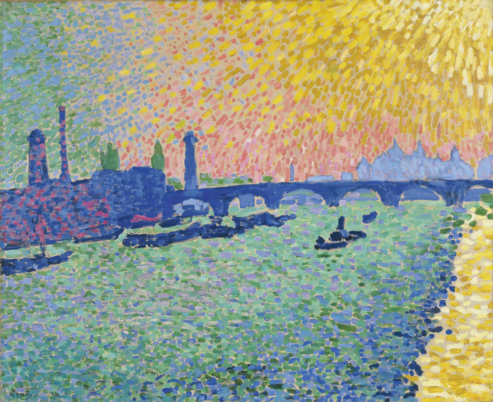

## 基本信息

- 作者：[[德朗 André Derain]]
- 创作年代：1906
- 材质：油彩，画布 (*not from wiki*)
- 现存地：(*not from wiki*)

## 画面与技法

[[德朗 André Derain]] 1906 年伦敦泰晤士河系列之一。画面被组织成**小点子构成的色块片段**——但与 [[新印象主义 Neo-Impressionism]] 的 [[点彩 Pointillism|点彩]] 不同，**德朗不进行视觉混色**，而是**把同颜色的小点子连成一片来进行构图**（顾衡 063：和 [[马蒂斯 Henri Matisse]] 一样的做法）。

色调上**偏爱绿和紫的冷色调**——这是顾衡 063 总结的 [[德朗 André Derain]] 与 [[马蒂斯 Henri Matisse]] **唯一显著的色调分野**（[[马蒂斯 Henri Matisse]] 更偏爱红和黄的暖色调）。

顾衡 063 把本作与 [[马蒂斯 Henri Matisse]] 同时期的 [[奢华、宁静与欢乐 Luxury Calm and Pleasure]] (1904) 直接对照——两人**同步性极强**。

## 历史背景 (*not from wiki*)

- 1905–1906 年 [[德朗 André Derain]] 受画商沃拉尔 (Ambroise Vollard) 委托前往伦敦，创作了约 30 幅伦敦风光，意在与 [[莫奈 Claude Monet]] 的伦敦组画（[[组画 Series Paintings]]）打擂台。
- 本作属于这批 1906 伦敦作品中最知名的几幅之一。

## 图片清单

| 编号 | 出自 | 描述 |
|---|---|---|
| 01 | [[063｜野兽派，除了马蒂斯还能谈什么？]] | 整幅画面——1906 伦敦组画 |

## 出现在

- [[063｜野兽派，除了马蒂斯还能谈什么？]] —— 用来对照马蒂斯 [[奢华、宁静与欢乐 Luxury Calm and Pleasure]]
