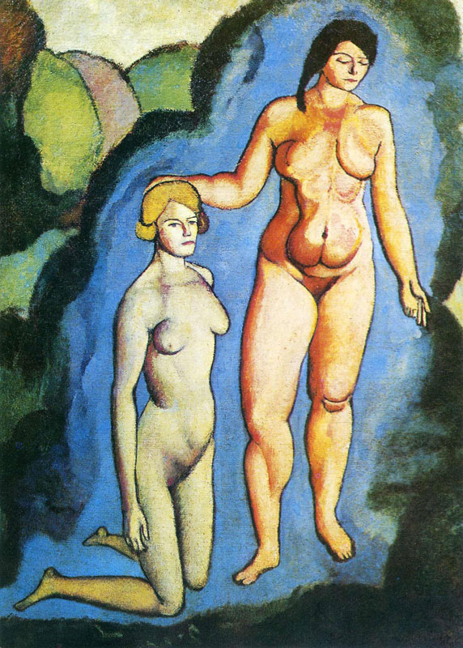

## 基本信息

- 作者：[[杜尚 Marcel Duchamp]]
- 创作年代：1911
- 材质：油画 (*not from wiki*)
- 尺寸：约 127 × 92 cm (*not from wiki*)
- 现存地：费城美术馆 Philadelphia Museum of Art (*not from wiki*)

## 画面与技法

本讲（088）作为杜尚 1911 年[[分析立体主义 Analytical Cubism]]期作品之一与《[[春天的年轻男女 Young Girl and Man in Spring]]》并列出场——同属"追求 [[象征主义 Symbolism]] 式寓意"的范畴，与塞尚的"避免画面寓意"形成鲜明对比。

(*not from wiki*) 画面是两位裸女在灌木丛前，一站一跪——常被读作"两个夏娃"或"母亲与女儿"的母题，亦有"启蒙 / 觉醒"寓意。

## 历史背景

(*not from wiki*) 杜尚 1911 年最大的一幅画之一；体现他这一时期试图把传统寓言题材与分析立体主义形式语言嫁接的努力。

## 图片清单

| 编号 | 出自 | 描述 |
|---|---|---|
| 01 | [[088｜杜尚1：他"好好画画"是什么样子的？]] | 整体图——灌木丛前两裸女 |

## 出现在

- [[088｜杜尚1：他"好好画画"是什么样子的？]]
