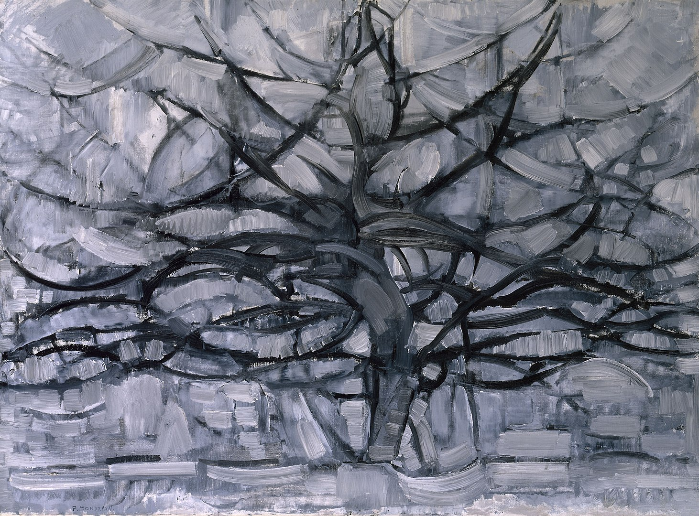

## 基本信息

- 作者：[[蒙德里安 Piet Mondrian]]
- 创作年代：1911
- 材质：(*not from wiki*：布面油画)
- 尺寸：(*not from wiki*：约 79 × 109 cm)
- 现存地：(*not from wiki*：海牙市立博物馆)

## 画面与技法

蒙德里安 1911 年赴巴黎、见识了 [[毕加索 Pablo Picasso]] 与 [[勃拉克 Georges Braque]] 的 [[分析立体主义 Analytical Cubism]] 之后的"画风随之大变"——树的枝干被解构为黑色弧线网络，色彩压缩到灰、蓝、绿的低饱和度区间，物象与背景的边界开始消融。

## 历史背景 (*not from wiki*)

承接 [[红树 (蒙德里安) Red Tree]]（1908–1910），开启蒙德里安通向抽象的过渡链条。其立体主义路径与 [[康定斯基 Wassily Kandinsky]] 的野兽派路径形成对照——顾衡明确指出："康定斯基是从马蒂斯的野兽派进入的抽象，而蒙德里安却是从毕加索的分析立体主义进入的抽象。"

## 图片清单

| 编号 | 出自 | 描述 |
|---|---|---|
| 01 | [[084｜蒙德里安：他为什么要画那么多格子？]] | 灰树（1911） |

## 出现在

- [[084｜蒙德里安：他为什么要画那么多格子？]]
