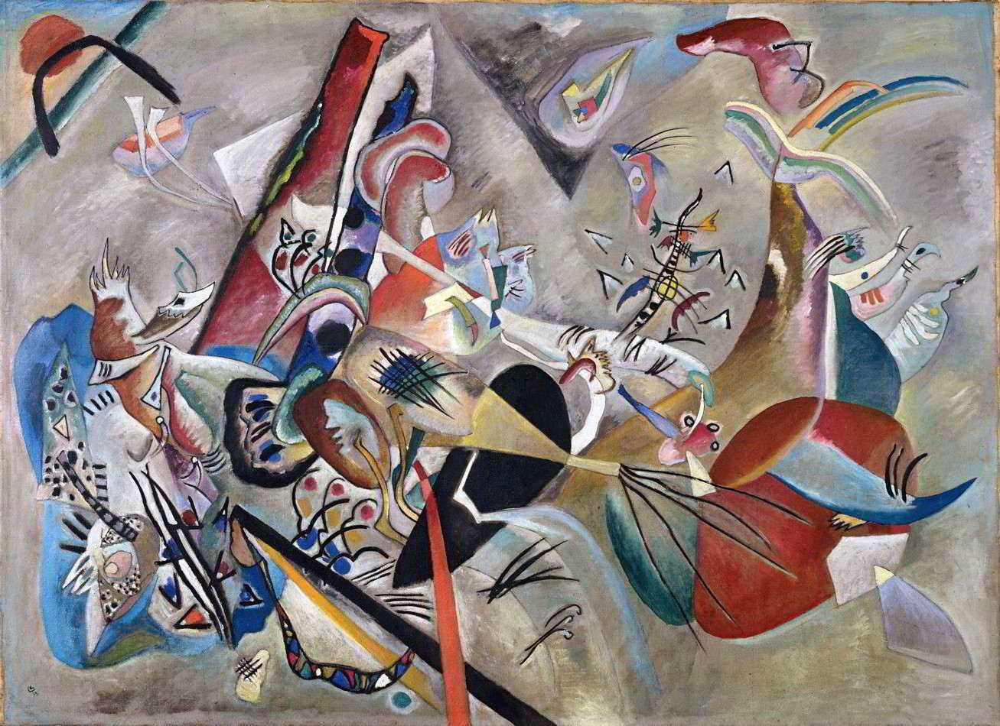

## 基本信息

- 作者：[[康定斯基 Wassily Kandinsky]]
- 创作年代：1919
- 材质：布面油画 (*not from wiki*)
- 尺寸：约 129 × 176 cm (*not from wiki*)
- 现存地：巴黎蓬皮杜中心 (Centre Pompidou, Paris) (*not from wiki*)

## 画面与技法

顾衡 082 与《[[构图218 Composition 218 (Two Ovals)]]》并列，作为**康定斯基一战后放弃"事后解释"习惯**的样本——1919 年的两件作品标志着他真正进入"纯抽象"阶段。

## 图片清单

| 编号 | 出自 | 描述 |
|---|---|---|
| 01 | [[082｜康定斯基2：他为什么走向抽象？]] | 一战后放弃具象事后解释的样本 |

## 出现在

- [[082｜康定斯基2：他为什么走向抽象？]]
