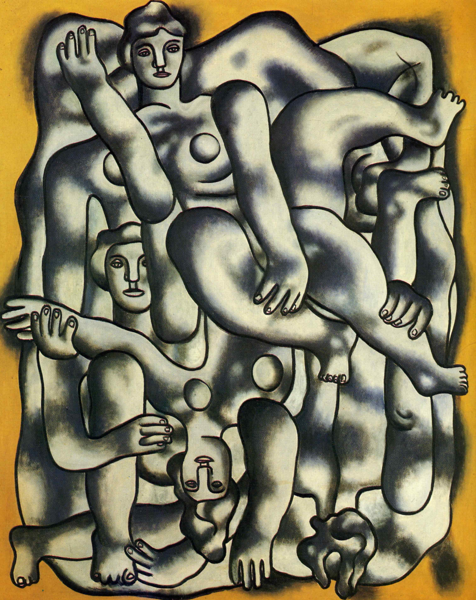

## 基本信息

- 作者：[[莱热 Fernand Léger]]
- 创作年代：1944
- 材质：布面油画 (*not from wiki*)
- 尺寸：约 184 × 152 cm (*not from wiki*)
- 现存地：私人收藏 / 数版本 (*not from wiki*)

## 画面与技法

二战末期莱热流亡美国时期创作。**杂耍演员**依旧由**圆柱体、椭圆体、圆环**拼接而成，但画面已转为更克制的灰白主调。

顾衡评莱热晚年："**晚年的莱热也曾经想有所突破，有所改变，但是并不成功。**"——管子始终是他的最终语言。

## 历史背景 (*not from wiki*)

二战中莱热在美国耶鲁大学任教。耶鲁聘他完全是因为他**特别爱聊艺术**，朋友形容他像个"英国拳击手"——但 [[阿波利奈尔 Guillaume Apollinaire]] 早就说过莱热"很单纯，有着非常稳固的推理能力"，**意思即一根筋的二楞子**。

## 图片清单

| 编号 | 出自 | 描述 |
|---|---|---|
| 01 | [[068｜立体主义，除了毕加索还值得了解什么？]] | 流亡美国时期的"管子杂耍演员" |

## 出现在

- [[068｜立体主义，除了毕加索还值得了解什么？]] —— 莱热晚年代表作
