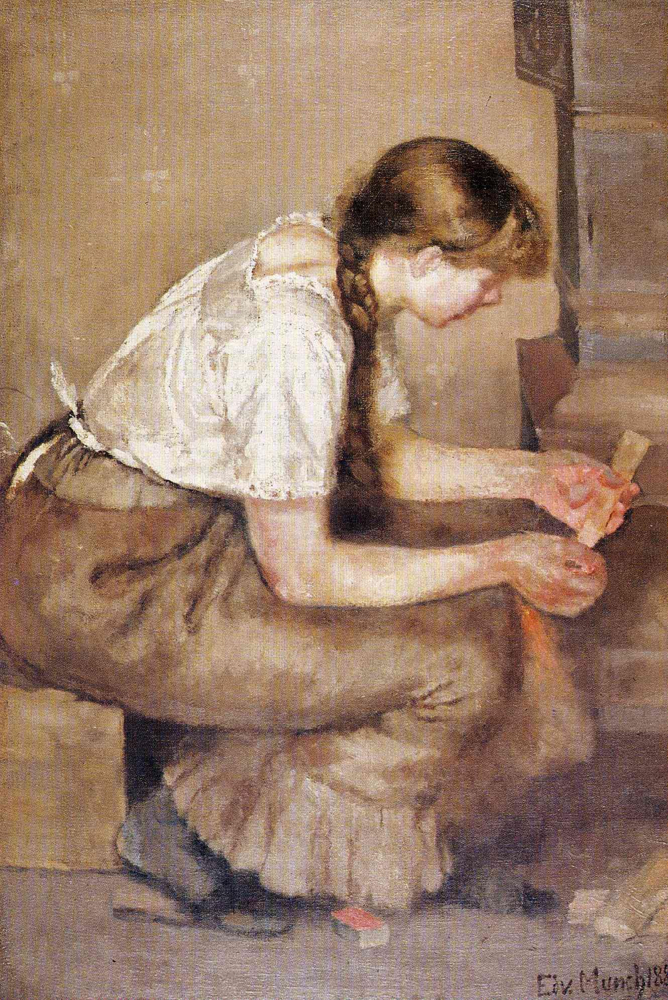

## 基本信息

- 作者：[[爱德华·蒙克 Edvard Munch]]
- 创作年代：1883
- 材质：布面油画 (*not from wiki*)
- 尺寸：未注明
- 现存地：未注明

## 画面与技法

蒙克早期作品——并非传统学院派画法，**表现出一定的现实主义倾向**，有点儿库尔贝、有点儿马奈（顾衡 070）——是蒙克通过老师 [[克里斯蒂安·克罗格 Christian Krohg]] 接触法国现代艺术后的产物。在当时挪威已属"最新锐的艺术"。

## 历史背景 (*not from wiki*)

蒙克 20 岁时所作。1883 年挪威整体仍处北欧艺术边缘——这种"室内劳动场景"题材直接借鉴 [[库尔贝 Gustave Courbet]] / [[马奈 Édouard Manet]] 走向的现实主义路线。

## 图片清单

| 编号 | 出自 | 描述 |
|---|---|---|
| 01 | [[070｜蒙克1：表现主义的先行者经历了什么？]] | 女孩儿俯身炉口 |

## 出现在

- [[070｜蒙克1：表现主义的先行者经历了什么？]]
